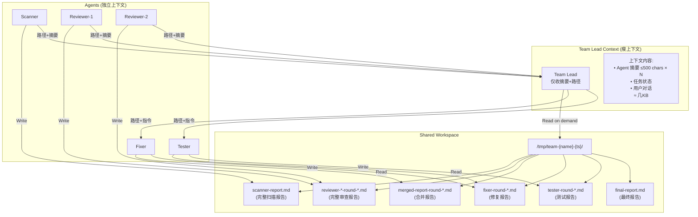
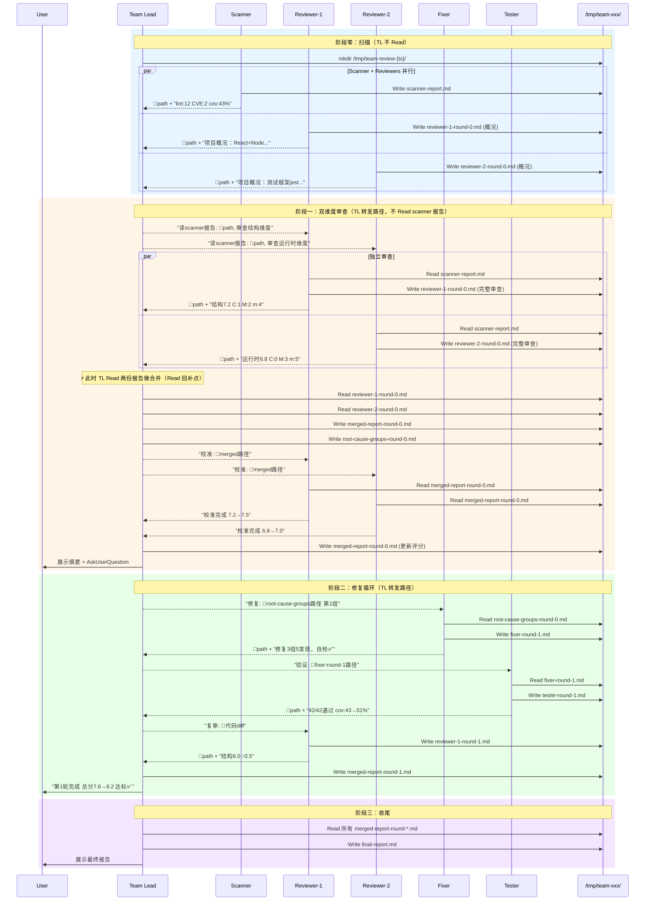
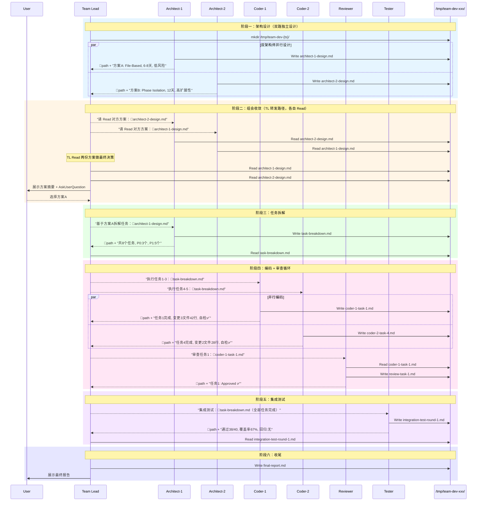

# RFC-2026-001: File-Based Handoff（文件交接模式）

| 字段 | 值 |
|------|-----|
| **RFC 编号** | RFC-2026-001 |
| **标题** | File-Based Handoff（文件交接模式） |
| **类型** | Feature |
| **状态** | Draft |
| **作者** | cto-fleet team |
| **日期** | 2026-03-28 |
| **关联问题** | "Request too large (max 20MB)" 上下文溢出 |

---

## 1. 摘要

本 RFC 提出 **File-Based Handoff（文件交接模式）**，解决 cto-fleet 多 agent 技能在长任务中触发 "Request too large (max 20MB)" 错误的问题。

核心思想：**将 agent 间的数据传递从"消息内联"改为"文件引用"**。Agent 将详细输出写入 `/tmp/{team-name}/` 目录下的 Markdown 文件，SendMessage 仅传递文件路径 + 结构化摘要（≤500 字符）。Team lead 按需 Read 文件获取完整内容，而非在对话上下文中累积全部报告。

**预期效果**：
- SendMessage 消息体积节省 ~90%
- Team lead 总上下文节省 ~50-60%（因 Read 回补，详见 §4.3）
- 5 轮 team-review 场景下，TL 上下文从 ~70KB 降至 ~30KB，远低于 20MB 限制

---

## 2. 背景与动机

### 2.1 问题现状

cto-fleet 的多 agent 技能（team-review、team-dev 等）在执行长任务时，team lead 的对话上下文持续膨胀，最终触发 Claude Code 的 20MB 请求大小限制。

**上下文膨胀的五大根因**：

1. **Double Independent Analysis（双独立分析）**：两位 reviewer 各自生成完整报告（~800 行/份），team lead 收到两份完整报告后还要合并转发
2. **Full Merge Broadcast（全量合并广播）**：合并报告被完整发送给每位 reviewer 做交叉校准，产生扇出效应
3. **Multi-Round History（多轮历史累积）**：5 轮迭代中，每轮的完整报告在 team lead 上下文中线性累积
4. **No Compression（无压缩机制）**：agent 消息无大小限制，动辄发送数千字符的完整报告
5. **User Confirmation Re-send（用户确认重发）**：每次向用户展示报告都会将完整内容加入上下文

### 2.2 当前模式（Context-Heavy）

```
scanner → SendMessage("完整的 2000 行扫描报告") → team lead context +2000 行
reviewer-1 → SendMessage("完整的 800 行审查报告") → team lead context +800 行
reviewer-2 → SendMessage("完整的 800 行审查报告") → team lead context +800 行
team lead → SendMessage("合并的 3600 行报告") → reviewer-1 context +3600 行
team lead → SendMessage("合并的 3600 行报告") → reviewer-2 context +3600 行
                                                    Total context: ~11000 行（仅第一轮）
```

### 2.3 文件交接模式（File-Referenced）

```
scanner → Write(文件) → SendMessage("路径+摘要 200字") → TL +200 字
TL → SendMessage(路径) → R1 +100 字  → R1 自行 Read
TL → SendMessage(路径) → R2 +100 字  → R2 自行 Read
R1 → Write → SendMessage("路径+摘要") → TL +200 字
R2 → Write → SendMessage("路径+摘要") → TL +200 字
TL → Read(R1 文件) + Read(R2 文件) → TL +1600 字（Read 回补，仅在合并时）
TL → Write(合并) → SendMessage(路径) → R1/R2 各 +100 字
                                        Total context: ~2400 字（同等信息量）
```

---

## 3. 目标与非目标

### 目标

1. **消除 20MB 限制触发**：使 team-review 5 轮、team-dev 全流程等最复杂场景不再触发请求大小限制
2. **降低 team lead 上下文增长速率**：将上下文增长系数降低 50-60%
3. **消除扇出效应**：agent A 的输出不再经过 team lead 中转放大，而是各接收方直接 Read 文件
4. **保持信息完整性**：完整报告存储在文件中，任何 agent 和用户均可按需访问
5. **渐进式推广**：按 skill 逐个改造，改造期间新旧模式可共存

### 非目标

1. **不改变 agent 架构**：不重构 team 生命周期、不引入 Phase Isolation、不改变 Agent 嵌套模式
2. **不减少 SKILL.md 自身大小**：SKILL.md 瘦身是独立优化项，不在本 RFC 范围
3. **不引入硬性技术约束**：依赖 prompt 指令约束 agent 行为，不引入代码级拦截
4. **不处理单 agent 上下文溢出**：本方案解决的是 agent 间通信导致的 team lead 上下文膨胀，非单个 agent 自身的上下文问题

---

## 4. 技术方案

### 4.1 核心机制

每个 agent 完成工作后执行**两步操作**：

**Step 1 — 写入完整报告到文件**：
```
使用 Write 工具写入完整报告到：
  /tmp/{team-name}/{role}-{round/task}.md
```

**Step 2 — 发送轻量引用消息**：
```
使用 SendMessage 发送（≤500 字符）：
  "✅ {角色} {阶段} 完成。
   📄 报告：{文件路径}
   📊 摘要：{关键指标/发现}"
```

### 4.2 目录结构与命名规范

#### 目录根路径

```
/tmp/team-{skill}-{YYYYMMDD-HHmmss}/
```

使用 `/tmp/` 前缀的理由：
- 跨 agent 可访问（所有 agent 共享同一文件系统和用户进程）
- 系统重启自动清理
- 不污染项目目录
- 命名含时间戳，不会跨会话冲突

#### 文件命名规范

| 角色输出 | 文件名模式 | 示例 |
|---------|-----------|------|
| Scanner 报告 | `scanner-report.md` | `scanner-report.md` |
| Reviewer-N 第R轮 | `reviewer-{N}-round-{R}.md` | `reviewer-1-round-0.md` |
| 合并报告第R轮 | `merged-report-round-{R}.md` | `merged-report-round-0.md` |
| 根因分组 | `root-cause-groups-round-{R}.md` | `root-cause-groups-round-0.md` |
| Fixer 第R轮 | `fixer-round-{R}.md` | `fixer-round-1.md` |
| Tester 第R轮 | `tester-round-{R}.md` | `tester-round-1.md` |
| Architect-N 方案 | `architect-{N}-design.md` | `architect-1-design.md` |
| 任务拆解 | `task-breakdown.md` | `task-breakdown.md` |
| Coder-N 任务T | `coder-{N}-task-{T}.md` | `coder-1-task-3.md` |
| 审查任务T | `review-task-{T}.md` | `review-task-3.md` |
| 集成测试 | `integration-test-round-{R}.md` | `integration-test-round-1.md` |
| 最终报告 | `final-report.md` | `final-report.md` |

> 仅当角色存在于当前 skill 时使用对应命名。未列出的角色用 `{role}-{context}.md` 格式。

#### 文件大小限制

为防止 Read 回补时上下文暴增，对写入文件施加大小约束：

| 约束 | 限制 | 理由 |
|------|------|------|
| 单个报告文件 | ≤ 2000 行 | Read 工具默认读取上限 |
| 如果报告超大 | 拆分为 summary 文件 + details 文件 | team lead 只 Read summary 部分 |
| SendMessage 摘要 | ≤ 500 字符 | 确保消息轻量 |

拆分示例：
```
/tmp/team-review-xxx/
├── reviewer-1-round-0.md              # 完整报告（≤2000行）
├── reviewer-1-round-0-details.md      # 如果超大，细节溢出到此文件
```

### 4.3 上下文节省量化分析（修正版）

#### 消息体积 vs 总上下文

需要明确区分两个层面的节省：

```
实际上下文 = SendMessage 消息 + Read 工具返回 + 系统提示 + 工具调用历史

文件交接改变的：   SendMessage 消息从 ~70KB → ~9KB（节省 ~87%）
文件交接未改变的： Read 返回仍然是完整文件内容（进入上下文）
文件交接未改变的： 系统提示、SKILL.md（~15-30KB）
文件交接未改变的： 工具调用元数据
```

**核心洞察**：文件交接的主要节省来自**消除扇出效应**，而非消除 Read。

当前模式下 TL 上下文累积（单轮审查）：
```
2000(scanner全文) + 800(R1全文) + 800(R2全文) + 1600×2(转发给R1/R2的消息也在TL历史中) = ~5200 字
```

文件交接模式下 TL 上下文累积（单轮审查）：
```
200(scanner摘要) + 100(转发R1路径) + 100(转发R2路径) + 200(R1摘要) + 200(R2摘要) + 1600(Read回补合并) = ~2400 字
```

**修正后的估算**：Team lead 总上下文节省约 **50-60%**（非 90%）。

#### Team Lead 各步骤 Read 需求及上下文影响

| 步骤 | TL 是否 Read | Read 内容量 | 上下文增量 | 备注 |
|------|:-----------:|:-----------:|:---------:|------|
| 收到 scanner 摘要 | 否 | — | ~200 字 | 仅路径转发给 reviewer |
| 转发 scanner 路径给 R1/R2 | 否 | — | ~200 字 | 纯路径转发 |
| 收到 R1/R2 审查摘要 | 否 | — | ~400 字 | 仅从摘要判断 |
| **合并 R1+R2 报告** | **是** | **~1600 字** | **~1600 字** | **必须 Read 才能合并** |
| 转发合并报告路径 | 否 | — | ~200 字 | 路径转发给 reviewer 校准 |
| 收到校准摘要 | 否 | — | ~200 字 | 仅评分增量 |
| 向用户展示摘要 | 是（可选） | ~800 字 | ~800 字 | 可只用摘要数据 |
| **分发根因组给 fixer** | 否 | — | ~200 字 | 路径转发 |
| 收到 fixer 摘要 | 否 | — | ~200 字 | 从摘要判断 |
| 分发 fixer 报告给 tester | 否 | — | ~100 字 | 路径转发 |
| 收到 tester 摘要 | 否 | — | ~200 字 | 从摘要判断 |
| **每轮小计** | — | — | **~4300 字** | 当前模式 ~14100 字 |
| **5 轮累计** | — | — | **~23500 字** | 当前模式 ~72500 字，节省 ~67% |

#### 上下文增长曲线对比

```
当前模式：上下文 = Σ(每轮全量报告) → O(rounds × report_size)
文件模式：上下文 = Σ(每轮摘要 + 少量 Read) → O(rounds × (summary_size + selective_read))

5 轮 team-review:
  当前：~70KB agent 消息 → 加上系统提示/工具输出轻松逼近 20MB
  文件：~24KB agent 消息 + Read → 远低于限制
```

### 4.4 消息摘要模板（Summary Schema）

采纳方案 B 的结构化摘要设计思想，为不同角色定义标准摘要模板。摘要使用 Markdown + YAML frontmatter 格式，确保 team lead 能从摘要中快速判断下一步动作，同时支持程序化解析。

#### Scanner 摘要模板

```
摘要：Lint违规{N}个 | 类型错误{N}个 | 高复杂度函数{N}个 |
      安全漏洞{N}个({Critical}个严重) | 覆盖率{N}% | 过时依赖{N}个
```

#### Reviewer 摘要模板

```
摘要：总分{X.X}/10 | Critical:{N} Major:{N} Minor:{N} Info:{N} |
      {维度1}:{分数} {维度2}:{分数} ... | 关键发现：{1-2句}
```

#### Fixer 摘要模板

```
摘要：修复{N}个根因组（{M}个发现）| 自检：lint{✅/❌} 测试{✅/❌} |
      无法修复：{N}个（原因简述）
```

#### Tester 摘要模板

```
摘要：通过{N}/{M} | 覆盖率{X}%→{Y}%(Δ{Z}%) |
      盲区{N}处 | 回归：{有/无}
```

#### Architect 摘要模板

```
摘要：方案名称 | 核心思想（1句）| 预估工期{N}天 |
      主要优势：{1-2点} | 主要风险：{1-2点}
```

#### Coder 摘要模板

```
摘要：任务{T}完成 | 变更{N}文件{M}行 |
      自检：lint{✅/❌} 测试{✅/❌} | 关键变更：{1-2句}
```

#### 完整报告文件格式（Summary Schema）

借鉴方案 B 的结构化摘要设计，报告文件使用 YAML frontmatter + Markdown body：

```markdown
---
type: analysis | fix_iteration | orchestration
phase: "round-0-review"
skill: "team-review"
team: "team-review-20260328-143022"
timestamp: "2026-03-28T14:35:00Z"
status: completed | failed | partial
scores:
  total: 6.5
  dimensions:
    code_quality: 7.0
    architecture: 6.0
findings_by_severity:
  critical: 2
  major: 5
  minor: 12
---

## Key Findings
...

## Metrics
...

## Root Cause Groups
...
```

### 4.5 Team Lead 读取策略

Team lead **不主动读取所有文件**，而是按需分层读取：

| 场景 | Team lead 动作 | Read？ |
|------|---------------|:------:|
| 收到 agent 摘要，需要合并报告 | Read 对应的 reviewer 文件 | 是 |
| 收到 agent 摘要，需要转发 | 仅转发文件路径 + 摘要给目标 agent | 否 |
| 需要向用户展示报告 | Read 合并报告文件 | 是 |
| 判断是否达标 | 仅从摘要中的评分判断 | 否 |
| 处理分歧/异常 | Read 涉及的具体文件 | 是 |

关键优化：**当 team lead 只需要转发信息时，不 Read 文件，只转发路径**。接收方自行 Read。

### 4.6 Agent 遵从性保障机制

仅靠 preamble 文字指令不足以保证 agent 遵从。设计以下验证机制：

**Team lead 侧校验规则**（写入 SKILL.md）：

> 当你收到 agent 消息时，检查以下条件：
> - 如果消息超过 **1000 字符**且不包含 `/tmp/` 文件路径，说明该 agent 可能忘记了文件交接模式
> - 此时要求该 agent："请将完整内容写入 `/tmp/{team-name}/` 目录下的文件，然后重新发送文件路径 + ≤500 字符摘要"
> - 不要处理超长的内联消息，要求 agent 重新以 handoff 模式发送

**Agent 侧强化指令**（写入 preamble）：

> **【必须遵守】文件交接模式**：
> - 你的 SendMessage 消息**绝对不能超过 500 字符**
> - 所有详细内容**必须**先 Write 到 `/tmp/{team-name}/` 目录
> - SendMessage 仅发送：文件路径（1行）+ 关键摘要（≤500字符）
> - 违反此规则会导致上下文溢出，整个任务失败

### 4.7 Preamble 片段设计

在每个 team-* skill 的 SKILL.md 中，在 TeamCreate 指令之后插入以下标准段落：

```markdown
## 文件交接规范

所有 agent 间传递详细报告时，必须采用**文件交接模式**：

1. **写入文件**：Agent 将完整报告/分析结果写入团队工作目录：
   - 目录路径：`/tmp/{team-name}/`（team lead 在 TeamCreate 后立即创建）
   - 文件命名见下方表格
   - 单个文件 ≤ 2000 行，超大报告拆分为 summary + details 文件
2. **发送引用**：Agent 通过 SendMessage 仅发送（≤500 字符）：
   - 文件路径（1 行）
   - 关键摘要（含核心指标/发现/评分）
3. **按需读取**：接收方使用 Read 工具按需读取文件，不要求发送方内联完整内容
4. **路径转发**：当 team lead 需要将报告从 A 转给 B 时，只转发文件路径 + 摘要，不 Read 后再 SendMessage
5. **遵从校验**：Team lead 收到超过 1000 字符且不含文件路径的消息时，要求 agent 重新以文件交接模式发送

**文件命名规范**：

| 角色输出 | 文件名 |
|---------|--------|
| Scanner 报告 | `scanner-report.md` |
| Reviewer-N 第R轮 | `reviewer-{N}-round-{R}.md` |
| 合并报告第R轮 | `merged-report-round-{R}.md` |
| 根因分组 | `root-cause-groups-round-{R}.md` |
| Fixer 第R轮 | `fixer-round-{R}.md` |
| Tester 第R轮 | `tester-round-{R}.md` |
| Architect-N 方案 | `architect-{N}-design.md` |
| Coder-N 任务T | `coder-{N}-task-{T}.md` |
| 审查任务T | `review-task-{T}.md` |
| 最终报告 | `final-report.md` |

> 仅当角色存在于当前 skill 时使用对应命名。未列出的角色用 `{role}-{context}.md` 格式。
```

### 4.8 Team Lead 工作目录初始化

Team lead 在 TeamCreate 之后、启动任何 agent 之前，执行：

```bash
mkdir -p /tmp/{team-name}
```

并将此路径通过 Agent 工具的 prompt 参数传入每个 agent。

### 4.9 详细流程图

#### 总体架构图



#### team-review 完整序列图



### 4.10 team-review 集成改造

以 team-review 为例，具体 SKILL.md 变更点：

**步骤 1（scanner + reviewer 启动）**：

当前写法：
> "输出**客观指标报告**发送给 team lead"

改为：
> "将客观指标报告写入 `/tmp/{team-name}/scanner-report.md`，通过 SendMessage 向 team lead 发送文件路径和≤500 字符的关键指标摘要"

**步骤 2（分发 scanner 报告）**：

当前写法：
> "Team lead 收到 scanner 报告后，将客观指标分发给两位 reviewer"

改为：
> "Team lead 将 scanner 报告的文件路径转发给两位 reviewer：`请阅读 /tmp/{team-name}/scanner-report.md 作为审查基准数据`。Team lead 不 Read 该文件，reviewer 各自 Read。"

**步骤 4（合并报告）**：

当前写法：
> "Team lead 合并报告：将两份报告合并为一份完整报告"

改为：
> "Team lead Read `/tmp/{team-name}/reviewer-1-round-0.md` 和 `reviewer-2-round-0.md`，合并后 Write 到 `/tmp/{team-name}/merged-report-round-0.md`，向 reviewer 发送文件路径和评分摘要。"

**步骤 6（用户确认）**：

当前写法：
> "Team lead 向用户展示：审查报告摘要（总分 + 客观指标 + 各维度分数）"

改为：
> "Team lead Read `/tmp/{team-name}/merged-report-round-0.md`，向用户展示摘要信息（总分 + 各维度分数 + 根因分组摘要）。完整报告位于文件中，用户可后续查阅。"

### 4.11 team-dev 集成改造

team-dev 涉及更多角色（architect×2、coder×2、reviewer、tester）和更多阶段（需求澄清、架构设计、任务拆解、编码、审查、集成测试），是最复杂的改造对象。

#### 阶段与文件交接点

| 阶段 | 角色 | Write 文件 | SendMessage 内容 | TL 是否 Read |
|------|------|-----------|-----------------|:------------:|
| 需求分级 | TL | — | — | — |
| 架构设计 | architect-1 | `architect-1-design.md` | 路径 + "方案A: xxx, 预估N天, 核心优势..." | 否（转发给组会） |
| 架构设计 | architect-2 | `architect-2-design.md` | 路径 + "方案B: xxx, 预估N天, 核心优势..." | 否（转发给组会） |
| 组会收敛 | TL + arch×2 | — | TL 转发两个方案路径给双方 | **是**（TL Read 两份方案做最终决策） |
| 任务拆解 | architect | `task-breakdown.md` | 路径 + "共N个任务, P0:M个, P1:K个" | **是**（TL Read 后分配任务） |
| 编码 | coder-1 | `coder-1-task-{T}.md` | 路径 + "任务T完成, 变更N文件M行, 自检✅" | 否（转发给 reviewer） |
| 编码 | coder-2 | `coder-2-task-{T}.md` | 路径 + "任务T完成, 变更N文件M行, 自检✅" | 否（转发给 reviewer） |
| 审查 | reviewer | `review-task-{T}.md` | 路径 + "任务T: Approved/Changes Requested" | 否（转发给 coder） |
| 集成测试 | tester | `integration-test-round-{R}.md` | 路径 + "通过N/M, 覆盖率X%, 回归:无" | **是**（TL Read 判断是否通过） |
| 收尾 | TL | `final-report.md` | 展示给用户 | 是（生成最终报告） |

#### team-dev 完整序列图



#### team-dev SKILL.md 关键变更示例

**架构设计阶段**：

当前写法：
> "两位 architect 各自输出完整技术方案发送给 team lead"

改为：
> "两位 architect 各自将完整技术方案写入 `/tmp/{team-name}/architect-{N}-design.md`，通过 SendMessage 向 team lead 发送文件路径 + 摘要（方案名称 + 核心思想 + 预估工期 + 主要优势/风险，≤500字符）"

**组会阶段**：

当前写法：
> "Team lead 将两份方案转发给对方 architect"

改为：
> "Team lead 将对方方案的文件路径转发给各 architect：`请 Read /tmp/{team-name}/architect-{对方N}-design.md 准备组会讨论`。TL 不 Read 方案文件（此时仅做路径转发），待需要做最终决策时再 Read。"

**编码阶段**：

当前写法：
> "Coder 完成编码后将变更摘要发送给 team lead"

改为：
> "Coder 将变更详情（修改的文件、关键变更说明、自检结果）写入 `/tmp/{team-name}/coder-{N}-task-{T}.md`，SendMessage 发送路径 + 摘要（任务号 + 变更文件数/行数 + 自检结果，≤500字符）。Team lead 将路径转发给 reviewer。"

### 4.12 team-pipeline 集成

team-pipeline 已有 500 字摘要模式。文件交接模式天然兼容：

- 子 skill 执行完成后，最终报告已在 `/tmp/team-{子skill}-{ts}/final-report.md`
- Pipeline 编排器提取摘要时，Read 该文件并压缩为 ≤500 字摘要传给下一步
- 额外优化：将各子 skill 的 final-report.md 路径也传递给下一个 skill，让下一个 skill 在需要深入了解前序分析时自行 Read，而非依赖摘要

---

## 5. 备选方案对比

### 方案 B：Phase Isolation + Structured Summarization（阶段隔离）

**核心思想**：利用 Agent 子进程天然具有独立上下文的特性，将长流程技能拆分为多个隔离阶段。Team lead 作为编排器，每个阶段通过独立的 Agent() 调用执行，阶段间仅传递结构化摘要。

**评分对比**：

| 维度 | 方案 A (File-Based Handoff) | 方案 B (Phase Isolation) |
|------|:-:|:-:|
| 可行性 | **8** | 5 |
| 风险 | **8** (低) | 4 (高) |
| 成本 | **7** (6-8天) | 4 (~12天) |
| 效果 | 6 (~50-60%) | **8** (~95%) |
| 可扩展性 | 5 | **8** |
| 运维复杂度 | **7** | 4 |
| **加权总分** | **6.8** | 5.5 |

**方案 B 优势**：
- 从根本消除上下文累积（每个 Phase Agent 完成后上下文随进程释放）
- 理论上支持无限轮次
- 上下文增长恒定（仅摘要累积）

**方案 B 被否决的核心原因**：

1. **Agent 嵌套 TeamCreate 的稳定性未验证**：Phase Agent 需要在 Agent() 内部 TeamCreate → spawn → TeamDelete，形成 3 层 Agent 嵌套。Claude Code 对此无明确支持保证。
2. **频繁 TeamCreate/TeamDelete 的性能开销**：5 轮 team-review 需要 ~8 次 TeamCreate/TeamDelete、~20+ 个 Agent 启停，每个周期 10-30 秒额外开销。
3. **跨阶段信息断裂**：Phase 1 reviewer 读代码形成的"隐性理解"无法通过 summary 传递给 Phase 2 的 fixer/reviewer。
4. **改造成本过高**：12 天工期，每个 SKILL.md 需要从扁平流程重构为阶段化编排。
5. **Feature flag 方案不切实际**：SKILL.md 是纯 Markdown 指令，无法做 if/else 分支。

**最终决策**：采纳方案 A（File-Based Handoff）为主，吸收方案 B 的 Summary Schema 设计（YAML frontmatter + 结构化摘要类型定义）。保留方案 B 作为长期演进路径——若方案 A 实施后 50-60% 节省仍不够，可在文件交接基础设施之上引入阶段隔离，届时改造成本会更低。

---

## 6. 风险与缓解

### 6.1 技术风险

| 风险 | 严重度 | 概率 | 缓解措施 |
|------|:------:|:----:|---------|
| Agent 忘记写文件，仍然内联全文 | 高 | 中 | 1) Preamble 中加粗强调规范 2) Team lead 侧 1000 字符校验机制（§4.6）3) 即使遗忘也只回退到当前模式，不影响功能 |
| Read 回补导致上下文增长超预期 | 中 | 中 | 1) 明确 Read 策略表（§4.3），只在必要时 Read 2) 文件 ≤2000 行限制 3) 大文件拆分为 summary+details |
| /tmp 目录权限问题 | 低 | 极低 | 所有 agent 共享同一用户进程，权限一致 |
| 文件命名冲突 | 中 | 低 | 命名含 round/task 编号；极端情况 team lead 可检测 |
| 旧 skill（未改造的）与新 skill 混用 | 中 | 中 | Phase 3 完成前存在此窗口；改造顺序优先处理 pipeline 中常组合的 skill |

### 6.2 运营风险

| 风险 | 严重度 | 缓解措施 |
|------|:------:|---------|
| 43 个 skill 改造的一致性 | 高 | 扩展 sync-preamble 工具自动检查 handoff 段落一致性 |
| 摘要质量差（agent 写了文件但摘要信息量不足） | 中 | 提供明确的摘要模板（§4.4），在 preamble 中给出示例 |
| /tmp 文件未清理（team 未正常收尾） | 低 | /tmp 系统重启自动清理；可在 TeamDelete 步骤加入 `rm -rf /tmp/{team-name}` |

### 6.3 用户体验风险

| 风险 | 描述 | 缓解措施 |
|------|------|---------|
| 最终报告在 /tmp 而非对话中 | 用户可能找不到完整报告 | 收尾阶段 team lead 仍向用户展示最终报告摘要；完整报告同时写入文件供归档 |
| 中间过程不透明 | 用户只看到摘要而非详细报告 | 用户确认节点仍展示关键内容；文件路径可供用户自行查阅 |

---

## 7. 实施计划

### Phase 1：基础设施（1 天）

1. **创建 `HANDOFF.md` 规范文件**：在 `~/.claude/skills/cto-fleet/` 根目录创建 `HANDOFF.md`，包含文件交接完整规范（§4.7 preamble 片段的扩展版，含 Summary Schema）
2. **修改 `bin/sync-preamble`**：扩展现有 sync-preamble 工具，支持同步 handoff 规范段落到所有 SKILL.md
3. **创建 `bin/handoff-init`** 辅助脚本：team lead 调用以初始化工作目录

### Phase 2：试点改造（2-3 天）

选择 3 个代表性 skill 作为试点：

| Skill | 选择理由 | 复杂度 |
|-------|---------|:------:|
| team-review | 最复杂的多轮迭代、最容易触发 20MB 限制 | 高 |
| team-dev | 最多角色、多阶段、worktree 隔离 | 高 |
| team-security | 典型的 scanner+auditor×2 模式（双独立分析） | 中 |

每个 skill 改造步骤：
1. 在 SKILL.md 中插入文件交接规范段落（在 TeamCreate 指令之后）
2. 修改每个角色的输出指令：从"发送给 team lead"改为"写入文件 + 发送路径摘要"
3. 修改 team lead 的转发逻辑：从"将报告发给"改为"将文件路径发给"
4. 修改合并/汇总逻辑：从"合并两份报告"改为"Read 两个文件 → Write 合并文件"
5. 端到端测试

### Phase 3：批量推广（2-3 天）

按 skill 模式分组批量改造：

| 模式 | Skills | 改造模板 |
|------|--------|---------|
| scanner+auditor×2+reporter | team-security, team-compliance, team-deps, team-governance, team-accessibility, team-i18n, team-feature-flag, team-observability | 套用 team-security 模板 |
| scanner+analyzer×2+reporter | team-arch, team-techdebt, team-cost, team-dora, team-cicd, team-chaos, team-perf, team-test, team-capacity | 套用 team-techdebt 模板 |
| researcher+designer×2+reviewer | team-rfc, team-api-design, team-interview, team-adr, team-vendor, team-contract-test | 套用 team-rfc 模板 |
| scanner+writer×2+reviewer | team-onboard, team-runbook, team-report, team-postmortem | 套用 team-onboard 模板 |
| 特殊流程 | team-refactor, team-migration, team-schema, team-incident, team-debug, team-release, team-threat-model, team-design-review, team-sprint | 逐一改造 |
| 编排类（无 agent team） | team-pipeline, team-cto-briefing, team-close, team-cleanup | 最小改动 |

### Phase 4：验证 + 文档（1 天）

1. 运行 `bin/sync-preamble --verbose` 确认所有 skill 的 handoff 规范一致
2. 用 team-pipeline 的 4-step 流水线端到端测试（最容易触发 20MB 的场景）
3. 更新 CHANGELOG、README

### 总工期：6-8 天

---

## 8. 测试策略

### 8.1 单元验证

- 对每个改造后的 SKILL.md 进行语法检查（handoff 段落完整性、文件命名规范一致性）
- `bin/sync-preamble --check` 验证所有 skill 的 handoff 段落一致

### 8.2 集成测试

| 测试场景 | 验证点 | 通过标准 |
|---------|--------|---------|
| team-review 3 轮小项目 | 文件创建、摘要格式、合并流程 | 不触发 20MB，文件存在且可读 |
| team-review 5 轮中等项目 | 极限场景压力测试 | 不触发 20MB，总上下文 < 50KB |
| team-dev 完整流程 | 多角色文件交接、worktree 集成 | 所有角色正确写文件+发摘要 |
| team-pipeline 4-step | 子 skill 间文件传递 | 最终报告完整，中间文件可追溯 |
| agent 遵从性测试 | 故意不给 handoff 指令的 agent | TL 正确触发 1000 字符校验并要求重发 |

### 8.3 回归测试

- 改造前后对同一项目执行 team-review，对比：审查报告质量（评分差异 <0.5）、发现的问题数量（无遗漏）、最终报告完整性

---

## 9. 监控与告警

N/A — 本方案为 prompt 指令层改动，无运行时监控组件。可通过以下方式间接观测效果：

- 改造前后记录 team-review 执行过程中的 TL 消息数量和平均长度
- 观察是否仍触发 20MB 错误
- 收集 /tmp 下文件的实际大小分布

---

## 10. 回滚方案

### 10.1 回滚机制

文件交接是**纯 additive 改动**——在现有 SendMessage 流程之上增加 Write 步骤，并将消息内容替换为路径+摘要。回滚只需：

1. **Preamble 回滚**：移除 SKILL.md 中的"文件交接规范"段落
2. **指令回滚**：将"写入文件 + 发送路径摘要"改回"发送完整报告给 team lead"
3. **运行 `bin/sync-preamble --fix`**：确保所有 skill 一致

### 10.2 Git 回滚

所有改动都在 SKILL.md 文件中，通过 git 管理：

```bash
# 回滚到文件交接之前的版本
git revert <handoff-commit-sha>

# 或者回滚特定 skill
git checkout <pre-handoff-sha> -- team-review/SKILL.md
```

### 10.3 渐进式回滚

可以按 skill 逐个回滚，不需要一次性全部回退：

1. 回滚出问题的特定 skill
2. 其他正常工作的 skill 保持文件交接模式
3. 两种模式可以共存——即使 agent 内联了全文，只要不超 20MB 就不影响功能（向下兼容）

### 10.4 回滚触发条件

| 条件 | 动作 |
|------|------|
| Agent 大量忘记写文件，导致 team lead 无法获取信息 | 检查 preamble 是否被正确注入，调整措辞强度 |
| Read 工具的额外延迟导致执行时间增加 >30% | 评估 Read 策略，减少不必要的 Read |
| 改造后审查质量下降（miss 明显问题） | 检查摘要模板信息量，增加 Read 触发场景 |
| 新版本 Claude Code 不再有 20MB 限制 | 根因消失，可逐步移除 handoff 规范（但保留也无害） |

---

## 11. 附录

### 附录 A：共识说明

本 RFC 基于以下评审流程形成共识：

1. **双路独立设计**：architect-1 设计方案 A（File-Based Handoff），architect-2 设计方案 B（Phase Isolation）
2. **独立评审**：reviewer 对两个方案进行对比评审，从可行性、风险、成本、效果、可扩展性、运维复杂度六个维度打分
3. **评审结论**：
   - 方案 A 加权总分 6.8，方案 B 加权总分 5.5
   - 推荐方案 A 为主，吸收方案 B 的 Summary Schema 设计
   - 方案 B 留作长期演进路径
4. **Must-fix 集成**：评审提出的 5 项 must-fix 已全部整合到本 RFC 中：
   - ✅ 修正 "90% 节省" 为 "50-60% 总上下文节省"（§4.3）
   - ✅ 添加 TL 各步骤 Read 需求及上下文影响表（§4.3）
   - ✅ 添加 agent 遵从性校验机制：>1000字符无文件路径则要求重发（§4.6）
   - ✅ 添加文件大小限制：≤2000行/文件，超大拆分（§4.2）
   - ✅ 添加 team-dev 详细改造示例（§4.11）

### 附录 B：方案 B Summary Schema TypeScript 类型定义（参考）

```typescript
interface SummaryFrontmatter {
  type: 'analysis' | 'fix_iteration' | 'orchestration';
  phase: string;           // "round-0-review", "round-2-fix"
  skill: string;           // "team-review"
  team: string;            // "team-review-20260328-143022"
  timestamp: string;       // ISO-8601
  status: 'completed' | 'failed' | 'partial';

  // For analysis type
  scores?: {
    total: number;
    dimensions: Record<string, number>;
  };
  findings_by_severity?: {
    critical: number;
    major: number;
    minor: number;
    info: number;
  };
  root_cause_groups?: number;

  // For fix_iteration type
  scores_before?: { total: number };
  scores_after?: { total: number };
  delta?: string;
  fixed_count?: number;
  remaining_critical?: number;
  remaining_major?: number;
  test_results?: {
    passed: number;
    failed: number;
    coverage_before: string;
    coverage_after: string;
  };
}
```

### 附录 C：/tmp 清理脚本

```bash
#!/bin/bash
# Clean up stale team working directories
# Run as: cto-fleet-cleanup-tmp.sh [--dry-run]

DRY_RUN=""
[[ "$1" == "--dry-run" ]] && DRY_RUN="echo [DRY RUN]"

for dir in /tmp/team-*-*/; do
  [ -d "$dir" ] || continue
  # Check if older than 24 hours
  if [[ $(find "$dir" -maxdepth 0 -mmin +1440 2>/dev/null) ]]; then
    $DRY_RUN rm -rf "$dir"
    echo "Cleaned: $dir"
  fi
done
```

### 附录 D：长期演进路径

如果方案 A 实施后发现 50-60% 节省仍不够（极端场景），可在文件交接基础设施之上引入方案 B 的阶段隔离：

1. **前提条件**：文件交接的命名规范、目录结构、摘要格式已就位
2. **增量引入**：仅对 team-review、team-dev 等最复杂的 skill 引入阶段隔离
3. **改造成本**：由于文件交接基础设施已存在，阶段隔离的改造仅需调整 team lead 编排模式，无需重新设计文件格式和命名规范
4. **验证方式**：先做 PoC 验证 Agent 嵌套 TeamCreate 的稳定性，通过后再推广
