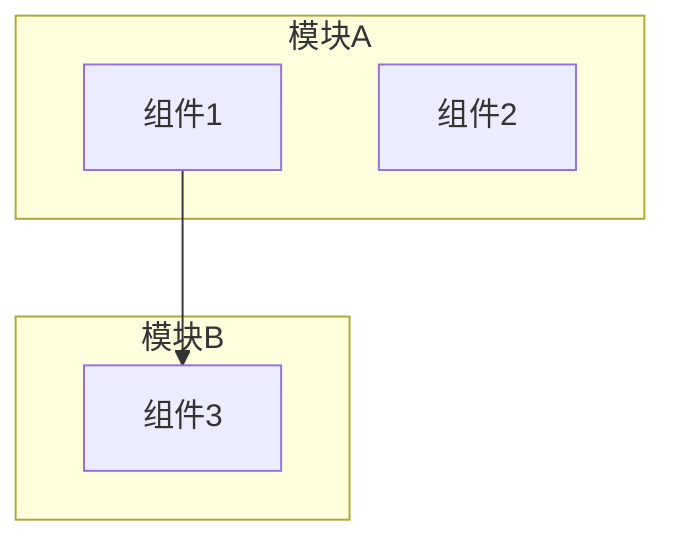
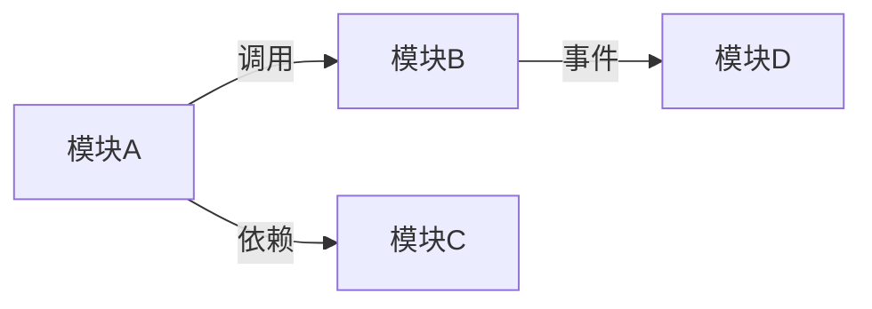
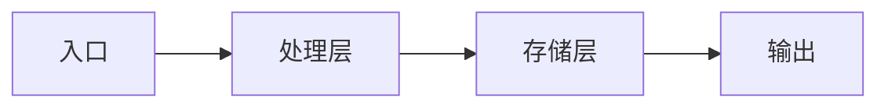

**参数解析**：从 `$ARGUMENTS` 中检测以下标志：
- `--auto`：完全自主模式（不询问用户任何问题，全程自动决策）
- `--once`：单轮确认模式（将所有需要确认的问题合并为一轮提问，确认后全程自动执行）
- `--depth=shallow|standard|deep`：分析深度（默认 `standard`）
- `--focus=module1,module2`：聚焦分析模块（可选，默认全量分析）
- `--lang=zh|en`：输出语言（默认 `zh` 中文）

| 模式 | 用户确认范围 | 条件节点处理 |
|------|-------------|-------------|
| **标准模式**（默认） | 项目概况确认 + 分歧仲裁 + 最终文档确认 | 正常询问用户 |
| **单轮确认模式**（`--once`） | 仅最终文档确认 | 自动决策 + 收尾汇总 |
| **完全自主模式**（`--auto`） | 不询问用户 | 全部自动决策，收尾汇总所有决策 |

单轮确认模式下条件节点自动决策规则：
- **分析深度不确定** → team lead 根据项目规模自行判断，在最终文档中说明
- **两位 analyzer 分歧** → analyst 标注分歧，team lead 综合论证后裁决，收尾时汇总
- **分歧超过 50%** → **不可跳过，必须暂停问用户**（熔断机制）
- **交叉验证异议超过 3 项** → **不可跳过，必须暂停问用户**（熔断机制）
- **项目过大无法完整分析** → scanner 识别核心模块，analyzer 聚焦核心模块
- **`--focus` 参数处理**：如果用户指定了 `--focus`，scanner 和 analyzer 优先分析指定模块，其余模块仅概览级别

完全自主模式下：所有节点均自动决策，不询问用户。熔断机制仍然生效（分歧超过 50%、交叉验证异议超过 3 项时仍必须暂停问用户）。

分析深度说明：

| 深度 | 分析范围 |
|------|---------|
| `shallow` | 仅项目结构和依赖概览，跳过深入架构模式分析。跳过交叉验证。 |
| `standard` | 结构 + 依赖 + 核心模块架构模式 + 数据流 |
| `deep` | 全量分析，额外包括性能热点、安全边界、技术债务、演进建议 |

使用 TeamCreate 创建 team（名称格式 `team-arch-{YYYYMMDD-HHmmss}`，如 `team-arch-20260308-143022`，避免多次调用冲突），你作为 team lead 按以下流程协调。

## 流程概览

```
阶段零  项目探测 → scanner 扫描结构 + 技术栈 + 运行自动化分析工具 → 输出项目概况 + 客观指标
         ↓
阶段一  并行分析 → scanner 深入依赖分析 + analyzer-1 独立分析 + analyzer-2 独立分析
         ↓
阶段二  共识合并 → analyst 对比两份分析 → 输出：共识/分歧/盲区清单 → 检查熔断
         ↓
阶段三  交叉验证 + 分歧仲裁 → analyzer 审阅合并结论标注异议 → team lead 仲裁
         ↓
阶段四  文档生成 → writer 生成最终 Markdown + Mermaid 图表 → 用户确认
         ↓
阶段五  收尾 → 保存文档 + 清理团队

shallow 流程：阶段零 → 阶段一（精简） → 阶段二（精简） → 跳过阶段三 → 阶段四 → 阶段五
```

## 角色定义

| 角色 | 职责 |
|------|------|
| scanner | 扫描项目结构、识别技术栈、运行自动化分析工具（依赖图/复杂度/代码量统计）、解析依赖关系。**只做结构层面分析和工具运行，不深入业务逻辑。** |
| analyzer-1 | 深入阅读核心模块代码，分析架构模式、模块间通信方式、数据流、错误处理策略。参与交叉验证。**独立分析阶段不与 analyzer-2 交流。** |
| analyzer-2 | 同 analyzer-1 的职责，独立执行相同分析。参与交叉验证。**独立分析阶段不与 analyzer-1 交流。** |
| analyst | 对比两位 analyzer 的分析报告，标注共识/分歧/盲区，输出结构化分析结果。**只做对比分析，不直接阅读代码，不生成最终文档。** 根本性矛盾必须标注为"待仲裁"升级 team lead。 |
| writer | 基于 analyst 的分析结果和仲裁结论，合并 scanner 的结构数据，生成 Mermaid 图表，撰写最终架构文档。**不做分析判断，不直接阅读代码。** |

---

## 阶段零：项目探测

### 步骤 1：启动 scanner

Team lead 启动 scanner，指示其快速扫描：
- 目录结构（顶层目录布局、最大深度 3 层）
- 入口文件（main 文件、index 文件、启动脚本）
- README 和文档目录
- 构建配置（Makefile、CMakeLists.txt、build.gradle、package.json、Cargo.toml 等）
- 包管理器和依赖文件
- CI/CD 配置（.github/workflows、.gitlab-ci.yml 等）
- 代码规范配置（lint、format、editorconfig）

### 步骤 2：运行自动化分析工具

Scanner 根据识别到的技术栈，运行可用的自动化工具收集客观指标：

| 指标类别 | 示例工具 | 输出 |
|---------|---------|------|
| 代码量统计 | cloc/tokei/scc | 语言分布、总行数、各模块行数 |
| 依赖图 | madge/depcheck/go mod graph | 模块间引用关系、循环依赖 |
| 复杂度分析 | radon/lizard/gocyclo | 函数/方法复杂度分布 |
| Lint 违规 | ESLint/Pylint/Clippy | 违规数量和类型分布 |
| 类型覆盖 | tsc --noEmit/mypy | 类型错误数量 |
| TODO/FIXME 分布 | grep TODO/FIXME/HACK/XXX | 数量和位置分布 |

**如果某工具未安装或无法运行**：scanner 标注"该指标不可用"，不阻塞流程。

Scanner 输出**项目概况报告**，包含：
- 项目名称和简述（来自 README）
- 编程语言及占比（来自代码量工具或估算）
- 框架和主要库
- 构建工具和包管理器
- 项目规模（文件数、代码行数）
- 识别到的核心模块/目录
- **客观指标摘要**：复杂度分布、lint 状况、TODO 分布等

### 步骤 3：评估分析深度

Team lead 根据 scanner 报告评估：
- 如果用户指定了 `--depth`，使用指定值
- 如果未指定：
  - 小型项目（<1 万行）→ 默认 `standard`，架构简单时可降为 `shallow`
  - 中型项目（1-10 万行）→ 默认 `standard`
  - 大型项目（>10 万行）→ 默认 `shallow`，用户要求 `deep` 时需警告耗时较长

**标准模式**：向用户展示项目概况 + 客观指标 + 深度建议，AskUserQuestion 确认
**单轮确认模式**：team lead 自行决定，收尾汇总时说明
**完全自主模式**：自动决策，不询问用户

---

## 阶段一：并行分析

### 步骤 4：启动 analyzer-1、analyzer-2 和 scanner 深入分析

三者并行启动，全程保持存活直到收尾。

Team lead 将 scanner 的客观指标报告分发给两位 analyzer，作为分析的基准数据。

**Scanner 深入依赖分析**：
- 解析 import/include/require 语句，构建模块间引用关系
- 解析包依赖（直接依赖 vs 间接依赖）
- 识别循环依赖
- 统计各模块的入度/出度（被依赖数/依赖数）

**Analyzer-1 和 Analyzer-2 各自独立分析**（team lead 必须确保两者不互相看到对方的报告）：

每位 analyzer 阅读核心模块代码，参考 scanner 的客观指标（如复杂度数据），输出结构化分析报告，包含：

1. **架构模式识别**：分层架构 / 微服务 / Monolith / 事件驱动 / CQRS / 管道-过滤器 / 其他。提供判断依据。
2. **模块划分与职责**：列出主要模块，每个模块的职责、对外接口、内部结构。
3. **数据流**：核心数据如何在模块间流转，入口到出口的主要路径。
4. **状态管理**：全局状态、共享状态、状态持久化方式。
5. **关键抽象和接口设计**：核心接口/抽象类/trait/protocol，设计意图和使用方式。
6. **错误处理策略**：错误如何传播、是否统一处理、异常 vs 错误码。

`deep` 模式额外分析：
7. **性能热点**：可能的性能瓶颈（参考 scanner 复杂度数据）、资源密集操作、缓存策略。
8. **安全边界**：输入验证、认证/授权边界、敏感数据处理。
9. **技术债务**：过时依赖、TODO/FIXME/HACK 注释（参考 scanner 统计）、已弃用 API 使用。

### 步骤 5：收集报告

三者完成后各自向 team lead 发送报告。Team lead 确认收到全部 3 份报告后，进入阶段二。

---

## 阶段二：共识合并

### 步骤 6：启动 analyst

Team lead 启动 analyst，将以下内容传递：
- Scanner 的项目概况报告和依赖分析报告
- Analyzer-1 的分析报告（标记为"分析师 A"）
- Analyzer-2 的分析报告（标记为"分析师 B"）

**重要**：传递时不透露 analyzer 编号，仅用"分析师 A"和"分析师 B"标记，避免暗示优先级。

### 步骤 7：Analyst 对比分析

Analyst 逐项对比两份分析报告，输出结构化分析结果：

| 对比结果 | 处理方式 |
|---------|---------|
| **一致结论** | 直接采纳，标记为"共识" |
| **互补发现**（A 发现了 B 没注意的点，或反之） | 合并，标记为"互补" |
| **措辞/粒度差异**（本质相同，表述不同） | 合并最佳表述，标记为"共识" |
| **分歧/矛盾**（对同一模块/模式有不同判断） | 标注为"待仲裁"，记录双方观点 |

Analyst 输出：
1. **共识清单**：双方一致的核心结论
2. **互补清单**：一方独有的有价值发现
3. **分歧清单**：矛盾之处及双方观点对比
4. **盲区清单**：两人都未充分覆盖的模块或维度（对照 scanner 识别的核心模块列表检查遗漏）
5. **共识度评估**：共识度 = (共识发现数 + 互补发现数) / 总发现数(去重并集) × 100%

**Analyst 处理矛盾的原则**：analyst 不直接阅读代码，当两份分析对同一模块/模式存在根本性矛盾时，必须标注为"待仲裁"并升级给 team lead，不得自行裁决。

### 步骤 8：检查熔断条件

如果共识度 < 50%（分歧占比超过一半）：
- **必须暂停**，team lead 向用户报告情况
- 可能原因：项目太大导致两位 analyzer 分析了不同部分、需求描述不够明确
- 建议：调整分析范围或缩小 depth

共识度 ≥ 50%：继续下一阶段。

### 步骤 9：处理盲区

如果盲区清单非空：
- Team lead 将盲区清单分配给两位 analyzer，要求补充分析遗漏的模块/维度
- Analyzer 补充后将补充报告发送给 analyst
- Analyst 将补充发现整合到已有分析中

如果盲区清单为空：直接进入下一阶段。

---

## 阶段三：交叉验证 + 分歧仲裁

**`shallow` 模式跳过此阶段，直接进入阶段四。**

### 步骤 10：交叉验证

Team lead 将 analyst 的合并分析结果（含共识结论和互补发现）分别发给 analyzer-1 和 analyzer-2，要求各自审阅：
- 合并结论中是否有与自己分析不符的地方
- 互补发现中对方的发现是否准确（各自只审阅对方独有的发现）
- 标注异议（如有），附上代码依据

**这是交叉验证，不是重新分析**——analyzer 只检查合并结论的准确性，不重做分析。

### 步骤 11：检查异议熔断

如果交叉验证异议总数 ≥ 3 项：
- **必须暂停**，team lead 向用户报告，可能存在系统性分析偏差
- 建议：调整分析范围或让 analyzer 聚焦争议模块

异议 < 3 项：将异议加入分歧清单，继续仲裁。

### 步骤 12：分歧仲裁

如果分歧清单（含交叉验证异议）为空 → 跳过仲裁，直接进入阶段四。

Team lead 对分歧清单中的每个分歧点：

1. 将分歧描述分别发给 analyzer-1 和 analyzer-2，要求各自提供论证：
   - 你的判断是什么？
   - 依据是哪些代码/文件/模式？
   - 为什么你认为对方的判断不准确？

2. 收到双方论证后：
   - **标准模式**：team lead 向用户展示分歧摘要和双方论证，AskUserQuestion 让用户裁决
   - **单轮确认模式/完全自主模式**：team lead 综合双方论证和代码证据自行裁决

3. 将仲裁结果发送给 analyst 更新分析

### 步骤 13：Analyst 更新分析

Analyst 根据仲裁结果和交叉验证反馈更新合并分析，将所有"待仲裁"项替换为最终结论。输出**最终合并分析报告**。

---

## 阶段四：文档生成

### 步骤 14：启动 writer 生成最终文档

Team lead 启动 writer，将以下内容传递：
- Scanner 的项目概况报告、依赖分析报告和客观指标
- Analyst 的最终合并分析报告
- 仲裁结果（如有）
- `--lang` 参数

Writer 按指定语言基于这些结构化输入生成最终架构文档。文档格式：

```markdown
# [项目名] 架构分析报告

> 生成时间：YYYY-MM-DD | 分析深度：shallow|standard|deep | 共识度：XX%

## 1. 项目概览

| 属性 | 值 |
|------|---|
| 编程语言 | [语言及占比] |
| 框架 | [主要框架] |
| 构建工具 | [构建工具] |
| 包管理器 | [包管理器] |
| 项目规模 | [文件数/代码行数] |
| 入口点 | [主入口文件] |

### 客观指标
| 指标 | 值 |
|------|---|
| 平均函数复杂度 | [值] |
| 高复杂度函数数 | [数量] |
| Lint 违规 | [数量] |
| TODO/FIXME | [数量] |

## 2. 架构总览

### 架构模式
[架构模式描述及判断依据]

### 架构总览图


## 3. 模块结构

### 模块列表

| 模块 | 路径 | 职责 | 对外接口 | 复杂度 |
|------|------|------|---------|--------|
| [模块名] | [路径] | [职责描述] | [关键接口] | [高/中/低] |

### 模块关系图


## 4. 数据流

### 核心数据流
[数据流描述]

### 数据流图


## 5. 依赖分析

### 外部依赖
| 依赖 | 版本 | 用途 |
|------|------|------|
| [名称] | [版本] | [用途] |

### 内部模块依赖
[循环依赖警告（如有）]
[高入度/高出度模块说明]

## 6. 关键设计决策
1. **[决策名称]**：[描述] — Trade-off：[权衡分析]
2. ...

## 7. 技术债务与演进建议（仅 deep 模式）

### 技术债务
| 类型 | 位置 | 描述 | 建议优先级 |
|------|------|------|-----------|
| [类型] | [文件:行号] | [描述] | Critical/Major/Minor |

### 演进建议
1. [建议描述]
2. ...

## 附录 A：分析共识说明

### 共识结论
[两位分析师一致的核心结论列表]

### 分歧点及仲裁结果
| 分歧点 | 分析师 A 观点 | 分析师 B 观点 | 仲裁结果 | 理由 |
|--------|-------------|-------------|---------|------|
| [描述] | [观点] | [观点] | [结论] | [理由] |

## 附录 B：交叉验证说明（standard/deep 模式）

### 验证结果
| 结论 | 验证状态 | 异议（如有） |
|------|---------|-------------|
| [结论] | 双方确认 / 有异议 | [异议内容] |
```

**注意**：每张 Mermaid 图不超过 15 个节点。如果模块过多，writer 分层展示（总览图 + 子模块详图）。

### 步骤 15：用户确认

Team lead 向用户展示文档摘要：
- 项目概览（一句话）+ 客观指标要点
- 识别到的架构模式
- 模块数量和核心模块
- 共识度
- 分歧数量及处理结果
- 交叉验证结果概要

AskUserQuestion 确认：
- 接受文档
- 需要补充某些方面的分析
- 需要调整某些结论

**单轮确认模式**：必须经用户确认。
**完全自主模式**：自动决策，不询问用户。

---

## 阶段五：收尾

### 步骤 16：保存文档

将最终架构文档保存到项目的 `docs/architecture/` 目录：
- 文件名：`architecture-analysis-YYYY-MM-DD.md`
- 如果目录不存在，创建之

### 步骤 17：最终总结

Team lead 向用户输出：
- 分析了什么（项目名称、范围、深度）
- 核心发现（架构模式、关键模块、主要数据流）
- 客观指标要点（复杂度、lint、技术债务标记）
- 共识度和分歧处理情况
- 交叉验证结果概要
- 文档保存位置
- **（单轮确认模式/完全自主模式）自动决策汇总**：列出所有自动决策的节点、决策内容和理由

### 步骤 18：清理

关闭所有 teammate，用 TeamDelete 清理 team。

---

## 核心原则

- **工具先行**：scanner 先运行自动化工具收集客观指标，为 analyzer 提供数据锚点
- **独立分析**：两位 analyzer 必须完全独立工作，不互相看到对方结果，确保共识的客观性
- **职责分离**：analyst 只做对比分析，writer 只做文档生成，不交叉职责
- **交叉验证**：合并后 analyzer 审阅合并结论，防止分析合并引入错误
- **共识驱动**：通过独立分析后的对比合并确保分析准确性，分歧必须仲裁
- **并行高效**：scanner 和两位 analyzer 并行工作，最大化效率
- **分层展示**：Mermaid 图表分层展示，每张图不超过 15 个节点
- **有限分析**：根据项目规模和 depth 参数控制分析范围，避免过度分析

---

## 错误处理

| 异常情况 | 处理方式 |
|---------|---------|
| 项目无法识别技术栈 | Scanner 输出目录结构和文件类型统计，analyzer 基于代码内容推断 |
| 项目过大无法完整分析 | Scanner 识别核心模块，analyzer 聚焦核心模块分析，文档说明分析范围限制 |
| 自动化工具未安装/无法运行 | Scanner 标注"该指标不可用"，analyzer 基于代码阅读评估 |
| 两位 analyzer 分析差异极大（共识度 < 50%） | 触发熔断，暂停问用户确认分析方向 |
| 交叉验证异议 ≥ 3 项 | 触发熔断，暂停问用户确认是否存在系统性分析偏差 |
| Mermaid 图表过于复杂 | Writer 分层展示（总览图 + 子模块详图），每张图不超过 15 个节点 |
| Analyzer 无法理解某模块 | 在报告中标注"未充分分析"，analyst 归入盲区清单 |
| 项目缺少 README/文档 | Scanner 基于代码结构和构建配置推断项目信息 |
| Analyst 盲区清单非空 | Analyzer 补充分析遗漏模块后 analyst 更新合并结果 |
| Teammate 无响应/崩溃 | Team lead 重新启动同名 teammate（传入完整上下文），从当前阶段恢复。如果是 analyzer 崩溃，检查已发送的部分报告决定是否需要重新分析。 |

---

## 需求

$ARGUMENTS
