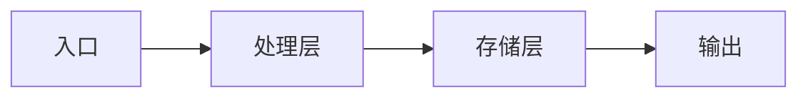
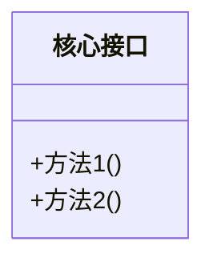

## Preamble (run first)

```bash
_UPD=$(~/.claude/skills/cto-fleet/bin/cto-fleet-update-check 2>/dev/null || true)
[ -n "$_UPD" ] && echo "$_UPD" || true
```

If output shows `UPGRADE_AVAILABLE <old> <new>`: read `~/.claude/skills/cto-fleet/cto-fleet-upgrade/SKILL.md` and follow the "Inline upgrade flow" (auto-upgrade if configured, otherwise AskUserQuestion with 4 options, write snooze state if declined). If `JUST_UPGRADED <from> <to>`: tell user "Running cto-fleet v{to} (just updated!)" and continue.

---

**参数解析**：从 `$ARGUMENTS` 中检测以下标志：
- `--auto`：完全自主模式（不询问用户任何问题，全程自动决策）
- `--once`：单轮确认模式（将所有需要确认的问题合并为一轮提问，确认后全程自动执行）
- `--target=newcomer|senior|all`：目标读者（默认 `all`）
- `--lang=zh|en`：输出语言（默认 `zh` 中文）

解析后将标志从项目路径或描述中移除。

| 模式 | 用户确认范围 | 条件节点处理 |
|------|-------------|-------------|
| **标准模式**（默认） | 扫描结果确认 + 文档内容确认 | 正常询问用户 |
| **单轮确认模式**（`--once`） | 仅最终文档确认 | 自动决策 + 收尾汇总 |
| **完全自主模式**（`--auto`） | 不询问用户 | 全部自动决策，收尾汇总所有决策 |

单轮确认模式下条件节点自动决策规则：
- **扫描结果有疑问** → team lead 根据项目结构自行判断，在最终文档中说明
- **两位 analyst 分歧** → team lead 综合论证后裁决，收尾时汇总
- **分歧超过 50%** → **不可跳过，必须暂停问用户**（熔断机制）
- **reviewer 判定内容有重大错误** → **不可跳过，必须暂停问用户**（熔断机制，单轮确认模式和完全自主模式均适用）

完全自主模式下：所有节点均自动决策，不询问用户。熔断机制仍然生效——触发熔断条件时是唯一会暂停询问用户的情况。
- **项目过大无法完整分析** → scanner 识别核心模块，analyst 聚焦核心模块

目标读者说明：

| Target | 侧重点 | 内容深度 |
|--------|--------|---------|
| `newcomer` | 基础概念、快速上手、常见问题 | 详细步骤，手把手引导 |
| `senior` | 架构决策、核心模块、性能关键路径 | 概念为主，深度分析 |
| `all` | 覆盖所有层次 | 分层组织，标注适用层级 |

使用 TeamCreate 创建 team（名称格式 `team-onboard-{YYYYMMDD-HHmmss}`，如 `team-onboard-20260308-143022`，避免多次调用冲突），你作为 team lead 按以下流程协调。

## 流程概览

```
阶段零  项目扫描 → scanner 全面扫描项目结构/技术栈/构建流程/CI/CD/配置/现有文档 → 输出项目概况
         ↓
阶段一  双路知识提取 → analyst-1 (架构/代码) + analyst-2 (流程/工具) 独立分析
         ↓
阶段二  合并审查 → team lead merge 两份报告 → reviewer 审查准确性/完整性/适用性 → 用户确认
         ↓
阶段三  文档生成 → writer 基于审查通过的内容生成全套文档
         ↓
阶段四  收尾 → 保存文档 + 清理团队
```

## 角色定义

| 角色 | 职责 |
|------|------|
| scanner | 扫描项目结构、技术栈、构建流程、CI/CD 配置、代码规范配置、现有文档和 README。输出项目概况报告。**只做结构层面扫描，不深入业务逻辑分析。** **阶段零完成后关闭。** |
| analyst-1 | 深入阅读核心模块代码，分析代码架构、核心模块职责、关键数据流、重要抽象和接口设计。**独立分析阶段不与 analyst-2 交流。** **阶段二审查完成后关闭（步骤 9 确认后）。** |
| analyst-2 | 分析开发流程、工具链配置、调试方法、常见问题模式、部署流程、测试策略。**独立分析阶段不与 analyst-1 交流。** **阶段二审查完成后关闭（步骤 9 确认后）。** |
| reviewer | 审查合并后的知识库内容——验证准确性、评估完整性、检查对目标读者的适用性。**只做审查，不直接阅读代码，不生成最终文档。** 发现重大错误必须标注为"待修正"升级 team lead。**阶段二审查完成后关闭（步骤 9 确认后）。** |
| writer | 基于审查通过的内容生成最终文档（快速上手指南、架构概览、开发手册、FAQ、术语表）。按 `--target` 调整内容深度和表述方式。**不做分析判断，不直接阅读代码。** **阶段三完成后关闭。** |

---

## 阶段零：项目扫描

### 步骤 1：启动 scanner

Team lead 启动 scanner，指示其全面扫描。**具体操作方法**：

- **目录结构**（顶层目录布局、最大深度 3 层）：`Bash("ls -la")` 顶层浏览 + `Bash("find . -maxdepth 3 -type d | head -100")` 获取目录树
- **入口文件**：`Glob("**/main.*", "**/index.*", "**/app.*", "**/server.*")` + `Grep("func main|if __name__|module\.exports|export default", head_limit=20)`
- **README 和文档目录**：`Glob("**/README*", "**/docs/**", "**/wiki/**", "**/*.md", "**/CONTRIBUTING*", "**/CHANGELOG*")`
- **构建配置**：`Glob("**/Makefile", "**/CMakeLists.txt", "**/build.gradle*", "**/pom.xml", "**/package.json", "**/Cargo.toml", "**/go.mod", "**/pyproject.toml", "**/setup.py", "**/setup.cfg")`
- **包管理器和依赖文件**：`Glob("**/package-lock.json", "**/yarn.lock", "**/pnpm-lock.yaml", "**/go.sum", "**/Cargo.lock", "**/requirements*.txt", "**/Pipfile*", "**/poetry.lock", "**/Gemfile*")`
- **CI/CD 配置**：`Glob("**/.github/workflows/*.yml", "**/.gitlab-ci.yml", "**/Jenkinsfile", "**/.circleci/**", "**/.travis.yml")`
- **代码规范配置**：`Glob("**/.eslintrc*", "**/.prettierrc*", "**/tslint.json", "**/.editorconfig", "**/.golangci*", "**/rustfmt.toml", "**/.flake8", "**/pyproject.toml")` + `Grep("lint|format|style", glob="**/Makefile")`
- **环境配置**：`Glob("**/.env.example", "**/.env.sample", "**/docker-compose*.yml", "**/Dockerfile*", "**/devcontainer/**")`
- **测试框架和测试目录**：`Glob("**/test/**", "**/tests/**", "**/spec/**", "**/__tests__/**", "**/test_*.py", "**/*_test.go", "**/*.test.*", "**/*.spec.*")` + 检查测试框架配置（jest.config、pytest.ini 等）
- **现有文档内容摘要**：Read 每个已识别的文档文件，提取标题和核心内容概要

### 步骤 2：Scanner 输出项目概况

Scanner 输出**项目概况报告**，包含：
- 项目名称和简述（来自 README）
- 编程语言及占比
- 框架和主要库
- 构建工具和包管理器
- 项目规模（文件数、代码行数估算）
- 识别到的核心模块/目录
- 现有文档清单及质量评估（有/无/过时）
- 开发环境要求（语言版本、依赖工具）
- CI/CD 流程概览
- 部署方式概览

**如果某类信息无法识别**：scanner 标注"未检测到"，不阻塞流程。

### 步骤 3：确认扫描结果

**标准模式**：向用户展示项目概况，AskUserQuestion 确认扫描结果是否准确、是否有遗漏
**单轮确认模式**：team lead 自行确认，收尾汇总时说明
**完全自主模式**：自动决策，不询问用户

确认后关闭 scanner。

---

## 阶段一：双路知识提取

### 步骤 4：启动 analyst-1 和 analyst-2

两者并行启动。Team lead 将 scanner 的项目概况报告分发给两位 analyst。

**analyst-1（架构/代码方向）独立分析**，输出结构化报告：

1. **代码架构**：分层架构 / 微服务 / Monolith / 事件驱动 / 其他，提供判断依据
2. **核心模块划分**：列出主要模块，每个模块的职责、对外接口、内部结构
3. **关键数据流**：核心数据如何在模块间流转，入口到出口的主要路径
4. **重要抽象和接口**：核心接口/抽象类/trait/protocol，设计意图和使用方式
5. **状态管理**：全局状态、共享状态、持久化方式
6. **错误处理策略**：错误传播方式、异常处理模式
7. **关键设计决策**：架构层面的重要选择及其 trade-off

**analyst-2（流程/工具方向）独立分析**，输出结构化报告：

1. **开发环境搭建**：完整的环境准备步骤（依赖安装、配置文件、环境变量）
2. **构建与运行流程**：从代码到可运行状态的完整步骤
3. **工具链详解**：使用的开发工具、IDE 配置、代码生成工具
4. **编码规范**：命名约定、代码风格、lint 规则、commit 规范
5. **分支策略**：分支模型、PR/MR 流程、代码审查流程
6. **CI/CD 流程**：自动化测试、构建、部署的完整流程
7. **调试方法**：常用调试手段、日志系统、监控告警
8. **测试策略**：单元测试、集成测试、E2E 测试的组织方式和运行方法
9. **常见问题**：开发中容易踩的坑、已知限制、FAQ 素材
10. **部署流程**：部署步骤、环境差异、回滚方案

**Team lead 必须确保 analyst-1 和 analyst-2 不互相看到对方的报告。**

### 步骤 5：收集报告

两者完成后各自向 team lead 发送报告。Team lead 确认收到全部 2 份报告后，进入阶段二。

---

## 阶段二：合并审查

### 步骤 6：Team lead 合并报告

Team lead 将两份报告按主题合并为统一的知识库草稿：
- analyst-1 的架构/代码分析 → 架构概览、核心模块、数据流部分
- analyst-2 的流程/工具分析 → 快速上手、开发手册、FAQ 部分
- 标注两份报告中涉及同一主题的交叉点（如模块职责描述 vs 调试方法中提到的模块行为）
- 如果交叉部分存在分歧，标注为"待审查"

合并时计算**一致度**：
- 交叉部分一致 → "共识"
- 交叉部分分歧 → "待审查"
- 一致度 = 共识数 / (共识数 + 分歧数) × 100%

**熔断检查**：如果一致度 < 50%（交叉部分分歧过多）：
- **必须暂停**，team lead 向用户报告情况
- 可能原因：项目文档与代码不一致、项目结构过于复杂
- 建议：缩小分析范围或由用户提供更多上下文

### 步骤 7：启动 reviewer 审查

Team lead 启动 reviewer，将以下内容传递：
- 合并后的知识库草稿
- Scanner 的项目概况报告
- `--target` 参数（目标读者）
- 分歧清单（如有）

Reviewer 审查维度：

| 审查维度 | 检查内容 |
|---------|---------|
| **准确性** | 技术描述是否正确、命令是否可执行、路径是否存在 |
| **完整性** | 是否覆盖了项目的关键方面、是否有遗漏的重要模块或流程 |
| **一致性** | 不同章节间的描述是否一致、术语使用是否统一 |
| **适用性** | 内容深度是否匹配目标读者（newcomer/senior/all） |
| **可操作性** | 步骤是否具体可执行、是否有模糊的"请参考"而无链接 |

Reviewer 输出：
1. **审查通过项**：确认无误的内容
2. **建议修改项**：小问题，附修改建议
3. **重大错误项**：严重不准确或误导性内容，标注为"待修正"

**熔断检查**：如果 reviewer 标注重大错误 ≥ 3 项：
- **必须暂停**，team lead 向用户报告，知识库内容可能存在系统性问题
- 建议：让 analyst 重新分析问题模块，或由用户提供准确信息

### 步骤 8：处理审查反馈

Team lead 处理 reviewer 的反馈：
- **建议修改项**：team lead 直接修正知识库草稿
- **重大错误项**（未触发熔断）：将问题发回对应 analyst 要求修正，analyst 修正后 team lead 更新草稿
- **分歧项**：
  - **标准模式**：向用户展示分歧和双方描述，AskUserQuestion 让用户裁决
  - **单轮确认模式**：team lead 综合判断后裁决
  - **完全自主模式**：自动决策，不询问用户

### 步骤 9：用户确认知识库内容

**标准模式**：向用户展示知识库摘要：
- 涵盖的主要内容板块
- reviewer 审查结果概要（通过率、修改项数、重大错误数）
- 分歧处理结果
- AskUserQuestion 确认是否可以生成最终文档

**单轮确认模式**：team lead 自行确认，进入下一阶段
**完全自主模式**：自动决策，不询问用户

确认后关闭 analyst-1、analyst-2、reviewer。

---

## 阶段三：文档生成

### 步骤 10：启动 writer 生成最终文档

Team lead 启动 writer，将以下内容传递：
- 审查通过的知识库内容
- Scanner 的项目概况报告
- `--target` 参数（目标读者）
- `--lang` 参数（输出语言）

Writer 根据 `--target` 调整内容：

| Target | 调整策略 |
|--------|---------|
| `newcomer` | 详细的步骤说明、截图位置标注、"为什么"解释、常见错误提示、手把手引导语气 |
| `senior` | 省略基础操作、侧重架构决策理由、性能关键路径、核心抽象设计意图 |
| `all` | 分层组织：每节开头概要（适合 senior 快速浏览），详细步骤（适合 newcomer 跟随） |

Writer 按指定语言生成以下 5 份文档。文档格式：

```markdown
# [项目名] 知识库

> 生成时间：YYYY-MM-DD | 目标读者：newcomer/senior/all

## 1. 快速上手

### 1.1 环境准备
[语言/运行时版本要求、系统依赖、推荐 IDE 及插件]

### 1.2 项目克隆与依赖安装
[git clone 命令、依赖安装步骤、常见安装问题]

### 1.3 配置文件
[需要修改的配置文件、环境变量设置、示例配置说明]

### 1.4 首次运行
[启动命令、验证运行成功的方法、预期输出]

### 1.5 开发-测试-提交流程
[日常开发的标准操作流程]

## 2. 架构概览

### 2.1 技术栈
| 类别 | 技术 | 用途 |
|------|------|------|
| [类别] | [技术名] | [用途说明] |

### 2.2 模块结构
[模块列表及职责描述]

### 2.3 数据流
[核心数据流描述]



### 2.4 核心抽象
[关键接口/抽象类说明及设计意图]



## 3. 开发手册

### 3.1 编码规范
[命名约定、代码风格、lint 规则]

### 3.2 分支策略
[分支模型、命名规范、PR/MR 流程]

### 3.3 CI/CD 流程
[自动化流水线说明、触发条件、各阶段作用]

### 3.4 调试指南
[日志查看方法、断点调试配置、常用调试命令]

### 3.5 常用命令速查
| 操作 | 命令 |
|------|------|
| [操作描述] | `[命令]` |

## 4. FAQ

### Q1: [常见问题]
**A**: [解答]

### Q2: [常见问题]
**A**: [解答]

## 5. 术语表

| 术语 | 全称/含义 | 说明 |
|------|----------|------|
| [术语] | [全称] | [在本项目中的具体含义] |

## 附录 A: 分析共识说明

> 一致度：XX% | 共识数：X | 分歧数：X

### 共识结论
[两位分析师交叉部分一致的发现列表]

### 分歧点及处理结果
| 分歧点 | 架构/代码视角 | 流程/工具视角 | 最终采纳 | 理由 |
|--------|-------------|-------------|---------|------|
| [描述] | [观点] | [观点] | [结论] | [理由] |

## 附录 B: 自主决策汇总（仅 --auto 或 --once 模式时生成）

| 决策节点 | 决策内容 | 理由 |
|---------|---------|------|
| [节点描述] | [决策内容] | [理由] |
```

**注意**：每张 Mermaid 图不超过 15 个节点。如果模块过多，writer 分层展示（总览图 + 子模块详图）。

### 步骤 11：用户确认文档

Team lead 向用户展示文档摘要：
- 生成的文档列表（5 份）
- 每份文档的章节概要
- 内容覆盖的关键主题
- 目标读者适配说明

AskUserQuestion 确认：
- 接受文档
- 需要补充某些内容
- 需要调整某些描述

**单轮确认模式、完全自主模式和标准模式均需用户确认最终文档。**

---

## 阶段四：收尾

### 步骤 12：保存文档

将最终文档保存到项目的 `docs/onboarding/` 目录：
- `getting-started.md` — 快速上手指南
- `architecture-overview.md` — 架构概览
- `developer-guide.md` — 开发手册
- `faq.md` — FAQ
- `glossary.md` — 术语表
- 如果目录不存在，创建之
- 同时生成 `docs/onboarding/README.md` 作为文档索引，列出所有文档及简述

### 步骤 13：最终总结

Team lead 按 `--lang` 指定的语言向用户输出：
- 分析了什么（项目名称、范围）
- 目标读者（newcomer/senior/all）
- 生成的文档列表及保存位置
- 知识库覆盖的主要内容
- reviewer 审查结果概要
- 分歧处理情况
- **（单轮确认模式/完全自主模式）自动决策汇总**：列出所有自动决策的节点、决策内容和理由

### 步骤 13.5：跨团队衔接建议（可选）

Team lead 根据项目情况向用户建议后续动作：
- **文档发现代码问题**：建议运行 `/team-review` 对项目做全面审查
- **架构复杂度高**：建议运行 `/team-refactor` 优化代码结构
- **API 文档缺失或不完整**：建议运行 `/team-api-design` 补全 API 设计文档
- **项目成本相关配置不合理**：建议运行 `/team-cost` 评估资源配置
- **项目有已知故障历史**：建议运行 `/team-postmortem` 补充复盘文档
- 用户可选择执行或跳过，不强制。

### 步骤 14：清理

关闭所有 teammate，用 TeamDelete 清理 team。

---

## 核心原则

- **全面扫描**：scanner 先全面了解项目全貌，为 analyst 提供完整的项目上下文
- **双路独立**：analyst-1 和 analyst-2 从不同维度独立分析，确保覆盖代码和流程两个层面
- **职责分离**：analyst 只做知识提取，reviewer 只做审查，writer 只做文档生成，不交叉职责
- **读者导向**：所有内容以目标读者的需求为中心，reviewer 专门检查适用性
- **准确优先**：reviewer 必须验证技术描述的准确性，命令的可执行性，路径的存在性
- **并行高效**：两位 analyst 并行工作，最大化效率
- **可操作性**：生成的文档必须包含具体可执行的步骤，不允许模糊的"请参考"
- **熔断保护**：分歧过大（一致度 < 50%）或重大错误过多（≥ 3 项）必须暂停问用户

---

## 错误处理

| 异常情况 | 处理方式 |
|---------|---------|
| 项目无 README 或文档 | Scanner 基于代码结构和配置文件推断项目信息，analyst 在报告中标注"无官方文档，以下基于代码分析" |
| 项目过大无法完整分析 | Scanner 识别核心模块，analyst 聚焦核心模块分析，文档说明分析范围限制 |
| 两位 analyst 交叉部分分歧过大（一致度 < 50%） | 触发熔断，暂停问用户确认 |
| Reviewer 发现重大错误 ≥ 3 项 | 触发熔断，暂停问用户确认是否存在系统性问题 |
| 构建/运行命令无法验证 | Writer 在文档中标注"未经验证，请确认"，FAQ 中补充可能的问题 |
| 项目使用非常规技术栈 | Scanner 记录所有可识别的配置，analyst 基于代码内容推断工具链 |
| 现有文档与代码不一致 | Analyst 在报告中标注不一致之处，reviewer 重点审查，FAQ 中说明 |
| Analyst 无法理解某模块 | 在报告中标注"未充分分析"，reviewer 归入完整性缺失项 |
| Mermaid 图表过于复杂 | Writer 分层展示（总览图 + 子模块详图），每张图不超过 15 个节点 |
| Teammate 无响应/崩溃 | Team lead 重新启动同名 teammate（传入完整上下文），从当前阶段恢复 |

---

## 需求

$ARGUMENTS
