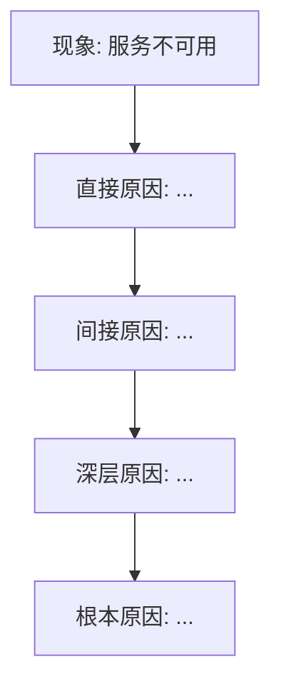

**参数解析**：从 `$ARGUMENTS` 中检测以下标志：
- `--auto`：完全自主模式（不询问用户任何问题，全程自动决策）
- `--once`：单轮确认模式（将所有需要确认的问题合并为一轮提问，确认后全程自动执行）
- `--lang=zh|en`：输出语言（默认 `zh` 中文）

解析后将标志从事件描述中移除。

| 模式 | 用户确认范围 | 条件节点处理 |
|------|-------------|-------------|
| **标准模式**（默认） | 时间线确认 + 分歧仲裁 + 最终报告确认 | 正常询问用户 |
| **单轮确认模式**（`--once`） | 仅最终报告确认 | 自动决策 + 收尾汇总 |
| **完全自主模式**（`--auto`） | 不询问用户 | 全部自动决策，收尾汇总所有决策 |

单轮确认模式下条件节点自动决策规则：
- **时间线存疑** → chronicler 标注不确定项，team lead 在报告中注明
- **两位 analyzer 根因分歧** → reviewer 标注分歧，team lead 综合信息后裁决，收尾时汇总
- **两位 analyzer 根因分歧 > 50%** → **不可跳过，必须暂停问用户**（熔断机制，单轮确认模式和完全自主模式均适用）
- **reviewer 否决改进措施（不够具体/不可执行）** → **不可跳过，必须暂停问用户确认改进方向**（熔断机制，单轮确认模式和完全自主模式均适用）

完全自主模式下：所有节点均自动决策，不询问用户。熔断机制仍然生效——触发熔断条件时是唯一会暂停询问用户的情况。

使用 TeamCreate 创建 team（名称格式 `team-postmortem-{YYYYMMDD-HHmmss}`，如 `team-postmortem-20260308-143022`，避免多次调用冲突），你作为 team lead 按以下流程协调。

## 流程概览

```
阶段零  事件概览 → team lead 解析事件描述 → 识别关键信息源（git log, deploy records, etc）
         ↓
阶段一  时间线重建 → chronicler 分析各种记录 → 输出精确时间线 → 完成后关闭
         ↓
阶段二  双路根因分析 → analyzer-1（技术根因）+ analyzer-2（流程根因）独立并行
         ↓
阶段三  合并分析 + 改进措施 → team lead 合并 → reviewer 验证 → 生成 action items
         ↓
阶段四  报告生成 + 收尾 → writer 生成标准化复盘报告 → 保存 → 清理团队
```

## 角色定义

| 角色 | 职责 |
|------|------|
| chronicler | 重建事件时间线：分析 git log、deploy history、告警记录、聊天记录、监控数据等。输出按分钟级精度排列的时间线，标注每个事件的来源和可信度。**阶段一完成后关闭。** |
| analyzer-1 | 从**技术根因**角度独立分析：代码缺陷、架构问题、技术债务、配置错误、依赖故障、容量瓶颈等。使用 5-Why 方法追溯根本原因。**独立工作，不与 analyzer-2 交流。** **阶段三步骤 12 确认后关闭。** |
| analyzer-2 | 从**流程根因**角度独立分析：变更管理流程、监控覆盖盲区、告警响应效率、知识盲区、文档缺失、On-call 机制、沟通协作等。使用 5-Why 方法追溯根本原因。**独立工作，不与 analyzer-1 交流。** **阶段三步骤 12 确认后关闭。** |
| reviewer | 审查分析结论和改进措施的可行性。**严格执行质量标准**：不接受"加强测试"/"提高监控"等空泛建议，每个措施必须具体可执行、有完成标准、有优先级。对分析结论做交叉验证，确保不遗漏关键根因。**阶段三步骤 12 确认后关闭。** |
| writer | 基于时间线、根因分析、reviewer 审查结果，生成标准化复盘报告（含 Mermaid 根因链图）。**不做分析判断，不自行搜索。** **阶段四完成后关闭。** |

---

## 改进措施质量标准

Reviewer 按以下标准审查每个改进措施，不达标则打回重写：

| 维度 | 要求 | 反例（不接受） | 正例（接受） |
|------|------|---------------|-------------|
| **具体性** | 明确做什么、改什么、怎么改 | "加强代码审查" | "在 CI 中增加 OOM 检测规则，对内存分配超过 X MB 的函数强制 reviewer 审批" |
| **可执行性** | 有明确的实施方向和技术路径 | "提高监控覆盖率" | "为 GPU 调度服务增加 queue depth > 1000 的告警规则，阈值基于过去 30 天 P99 * 1.5" |
| **完成标准** | 可验证是否完成 | "优化部署流程" | "部署流程增加灰度发布阶段：先 1% 流量验证 10 分钟，无告警后扩至 100%" |
| **优先级** | P0/P1/P2 分级 | 无优先级 | P0: 48 小时内完成 |
| **截止日期** | 有建议完成时间 | 无时间要求 | 建议 2 周内完成 |

---

## 阶段零：事件概览

### 步骤 1：解析事件描述

Team lead 解析 `$ARGUMENTS` 中的事件描述或 incident 报告路径：
- 如果是文件路径 → Read 读取 incident 报告内容
- 如果是文字描述 → 提取关键信息
- 确定报告语言（`--lang` 参数或默认中文）

提取以下关键信息：
- 事件概述（什么服务/功能出了什么问题）
- 大致时间范围（发生时间、发现时间、恢复时间）
- 影响范围（用户数、业务线、数据损失）
- 严重程度初判（P0/P1/P2/P3）

### 步骤 2：识别信息源

Team lead 扫描工作目录和相关路径，识别可用的信息源：
- **代码变更**：git log、git diff、PR/MR 记录
- **部署记录**：deploy history、CI/CD pipeline logs
- **告警记录**：告警系统日志、PagerDuty/飞书告警
- **监控数据**：metrics dashboard、APM traces
- **沟通记录**：incident channel 聊天记录、会议纪要
- **配置变更**：配置文件 diff、feature flag 变更

将识别到的信息源列表和事件概要整理为任务上下文。

### 步骤 3：确认事件范围

- **标准模式**：向用户展示事件概要和识别到的信息源列表，AskUserQuestion 确认：
  - 事件描述是否准确
  - 是否有遗漏的信息源
  - 是否需要补充背景信息
- **单轮确认模式**：team lead 基于已有信息直接推进
- **完全自主模式**：自动决策，不询问用户

---

## 阶段一：时间线重建

### 步骤 4：启动 chronicler

Team lead 启动 chronicler，将以下内容传递：
- 事件概要（时间范围、影响范围、严重程度）
- 信息源列表及路径
- 时间线粒度要求（分钟级）

### 步骤 5：Chronicler 重建时间线

Chronicler 按时间顺序分析所有可用信息源，**具体操作方法**：

1. **代码变更分析**：
   - `git log --since="<事件前24h>" --until="<事件后6h>" --oneline --all` 查找时间窗口内所有提交
   - `git log --merges --since="<时间>" --until="<时间>"` 查找合并记录
   - `git diff <事件前commit>..<事件后commit> --stat` 查找变更范围
   - `git log --author="<部署系统账号>" --since="<时间>"` 识别自动化提交
2. **部署记录分析**：
   - 搜索 CI/CD 配置：`Glob("**/.github/workflows/*.yml", "**/.gitlab-ci.yml", "**/Jenkinsfile", "**/.circleci/**")`
   - 搜索部署脚本和日志：`Glob("**/deploy/**", "**/deployment/**", "**/scripts/deploy*")`
   - 搜索 Helm/K8s 部署记录：`Glob("**/helm/**", "**/k8s/**", "**/manifests/**")`
   - 检查 `git tag` 查找部署标签：`git tag --sort=-creatordate | head -20`
3. **告警记录分析**：
   - 搜索告警配置以了解告警规则：`Glob("**/alerts/**", "**/alerting/**", "**/prometheus/**/*.yml", "**/grafana/**")`
   - 搜索告警相关代码：`Grep("alert|alarm|pager|oncall|incident", type="yaml")`
   - 检查监控配置：`Glob("**/monitoring/**", "**/datadog/**", "**/newrelic/**", "**/sentry**")`
4. **监控数据分析**：
   - 搜索监控配置了解关键指标：`Grep("metric|gauge|counter|histogram|SLO|SLA|SLI", type="yaml")`
   - 搜索日志配置了解日志位置：`Grep("log_file|logfile|LOG_PATH|log_dir", type="代码文件")`
   - 检查 dashboard 定义：`Glob("**/dashboards/**/*.json", "**/grafana/**/*.json")`
5. **沟通记录分析**：如果用户提供了聊天记录/会议纪要路径，Read 读取并提取关键时间点和决策

Chronicler 输出结构化时间线：

| 时间 | 事件 | 操作人/系统 | 来源 | 备注 |
|------|------|------------|------|------|
| HH:MM | [事件描述] | [人/系统] | [git/deploy/alert/...] | [不确定项标注] |

标注关键时间节点：
- **T0**：故障实际发生时间
- **T1**：故障被发现时间（检测时间 = T1 - T0）
- **T2**：开始响应时间
- **T3**：故障恢复时间（恢复时间 = T3 - T1）

### 步骤 6：确认时间线

- **标准模式**：team lead 向用户展示时间线，AskUserQuestion 确认：
  - 时间线是否完整准确
  - 是否有遗漏的关键事件
  - 不确定项的澄清
- **单轮确认模式**：跳过，标注不确定项在报告中注明
- **完全自主模式**：自动决策，不询问用户

确认后关闭 chronicler。

---

## 阶段二：双路根因分析

### 步骤 7：启动 analyzer-1 和 analyzer-2

两者并行启动，独立分析。Team lead 将以下内容分别发给两位 analyzer：
- 确认后的事件时间线
- 事件概要和影响范围
- 相关代码/配置路径

**重要**：两位 analyzer 全程独立工作，不互相交流，不看到对方的分析结果。

**Analyzer-1（技术根因）**：
- 分析事件时间窗口内的代码变更（git diff、PR review）
- 审查相关服务的架构设计和依赖关系
- 检查配置变更和环境差异
- 评估技术债务对事件的贡献
- 使用 5-Why 方法从现象追溯到技术根本原因
- 输出：技术根因分析报告 + 5-Why 链 + 技术改进建议

**Analyzer-2（流程根因）**：
- 分析变更管理流程是否被遵循（review、测试、灰度）
- 评估监控和告警的覆盖度和有效性
- 审查事件响应流程（检测→通知→响应→恢复）
- 检查知识文档和 runbook 的完备性
- 评估团队沟通和协作效率
- 使用 5-Why 方法从现象追溯到流程根本原因
- 输出：流程根因分析报告 + 5-Why 链 + 流程改进建议

### 步骤 8：收集分析报告

两者完成后各自向 team lead 发送报告。Team lead 确认收到全部 2 份报告后，进入阶段三。

---

## 阶段三：合并分析 + 改进措施

### 步骤 9：合并根因分析

Team lead 对比两份分析报告，整理为：

| 对比结果 | 处理方式 |
|---------|---------|
| **一致结论** | 直接采纳，纳入根因链 |
| **互补发现**（技术视角发现流程问题或反之） | 合并，标注交叉发现 |
| **分歧/矛盾**（对根因判断不同） | 标注为"待仲裁" |

输出：
1. **根因共识清单**：双方一致认定的根因
2. **互补发现清单**：一方独有的有价值发现
3. **分歧清单**：矛盾之处及双方论证
4. **综合 5-Why 根因链**：合并技术和流程两条 5-Why 链

**共识度评估**：共识度 = (共识发现数 + 互补发现数) / 总发现数(去重并集) x 100%

### 步骤 10：检查熔断条件 + 分歧仲裁

如果共识度 < 50%（两位 analyzer 根因分歧超过一半）：
- **必须暂停**，team lead 向用户报告情况
- 可能原因：事件信息不充分、存在多重根因、分析视角偏差
- 建议：补充事件信息或由用户指定分析重点

共识度 >= 50% 且存在分歧：
- **标准模式**：team lead 向用户展示分歧摘要和双方论证，AskUserQuestion 让用户裁决
- **单轮确认模式**：team lead 综合双方论证自行裁决，收尾时汇总
- **完全自主模式**：自动决策，不询问用户

无分歧 → 直接进入改进措施。

### 步骤 11：生成改进措施 + Reviewer 审查

Team lead 基于合并后的根因分析，整理改进措施草案，然后启动 reviewer。

将以下内容传递给 reviewer：
- 合并后的根因分析（含共识、互补、仲裁结果）
- 综合 5-Why 根因链
- 改进措施草案
- 事件时间线

Reviewer 审查内容：

1. **根因完整性**：是否遗漏关键根因，5-Why 是否追溯到位（不能停在表面原因）
2. **改进措施质量**：逐条按质量标准审查（具体性、可执行性、完成标准、优先级、截止日期）
3. **改进措施覆盖度**：每个根因是否有对应的改进措施
4. **措施分类合理性**：技术/流程/监控/文档分类是否准确

Reviewer 输出：
- **通过的措施**：符合质量标准的改进措施
- **打回的措施**：不符合标准的措施 + 具体打回理由 + 改进方向
- **补充建议**：遗漏的改进措施

**熔断条件**：如果 reviewer 否决超过半数改进措施（判定为空泛不可执行）：
- **必须暂停**，team lead 向用户报告情况，展示 reviewer 的打回理由
- 建议：由用户确认改进方向后，team lead 重新制定改进措施

### 步骤 12：修订改进措施

Team lead 根据 reviewer 的反馈修订改进措施：
- 打回的措施按 reviewer 建议具体化
- 补充遗漏的措施
- 将修订后的措施再次发给 reviewer 确认

循环直到 reviewer 通过所有措施（最多 2 轮修订，第 3 轮仍不通过则暂停问用户）。

确认后关闭 analyzer-1、analyzer-2、reviewer。

---

## 阶段四：报告生成 + 收尾

### 步骤 13：启动 writer 生成复盘报告

Team lead 启动 writer，将以下内容传递：
- 确认后的事件时间线
- 合并后的根因分析（含 5-Why 链）
- 审查通过的改进措施
- 事件概要（严重程度、影响范围、关键时间节点）
- 分歧仲裁结果（如有）
- `--lang` 参数

Writer 按指定语言生成标准化复盘报告。文档格式：

```markdown
# 复盘报告: [事件标题]

| 属性 | 值 |
|------|---|
| 事件日期 | YYYY-MM-DD |
| 严重程度 | P0/P1/P2/P3 |
| 影响范围 | [影响描述] |
| 持续时间 | [从发生到恢复] |
| 检测时间 | [从发生到发现] |
| 恢复时间 | [从发现到恢复] |

## 1. 事件摘要

[200-300 字的事件概述：什么服务出了什么问题，影响了哪些用户/业务，如何发现和恢复的]

## 2. 时间线

| 时间 | 事件 | 操作人/系统 | 备注 |
|------|------|------------|------|
| HH:MM | [事件描述] | [人/系统] | [关键标注] |

关键时间节点：
- **T0（故障发生）**：HH:MM
- **T1（故障发现）**：HH:MM（检测耗时：X 分钟）
- **T2（开始响应）**：HH:MM（响应耗时：X 分钟）
- **T3（故障恢复）**：HH:MM（恢复耗时：X 分钟）

## 3. 影响分析

### 3.1 用户影响
[受影响用户数量、影响程度、用户感知]

### 3.2 业务影响
[受影响业务线、营收损失、SLA 影响]

### 3.3 数据影响
[数据丢失/损坏情况、数据一致性影响]

## 4. 根因分析

### 4.1 技术根因
[代码缺陷/架构问题/配置错误/依赖故障等]

### 4.2 流程根因
[变更管理/监控盲区/响应效率/知识盲区等]

### 4.3 根因链（5-Why 分析）



技术根因链：
1. **Why**: 为什么服务不可用？→ ...
2. **Why**: 为什么...？→ ...
3. **Why**: 为什么...？→ ...
4. **Why**: 为什么...？→ ...
5. **Why**: 为什么...？→ **根本原因**

流程根因链：
1. **Why**: 为什么没有提前发现？→ ...
2. **Why**: 为什么...？→ ...
3. **Why**: 为什么...？→ ...
4. **Why**: 为什么...？→ ...
5. **Why**: 为什么...？→ **根本原因**

## 5. 改进措施

| 编号 | 措施 | 类型 | 优先级 | 负责人 | 截止日期 | 状态 |
|------|------|------|--------|--------|---------|------|
| 1 | [具体措施描述] | 技术 | P0 | [待定] | YYYY-MM-DD | 待开始 |
| 2 | [具体措施描述] | 流程 | P1 | [待定] | YYYY-MM-DD | 待开始 |
| 3 | [具体措施描述] | 监控 | P1 | [待定] | YYYY-MM-DD | 待开始 |
| 4 | [具体措施描述] | 文档 | P2 | [待定] | YYYY-MM-DD | 待开始 |

措施类型：技术 / 流程 / 监控 / 文档
优先级：P0（48小时内）/ P1（1周内）/ P2（2周内）

## 6. 经验教训

### 6.1 做得好的
- [事件响应中值得肯定的做法]
- [有效的工具/流程/协作]

### 6.2 需要改进的
- [响应过程中暴露的问题]
- [流程/工具/能力的不足]

## 7. 参考信息

| 序号 | 信息源 | 类型 | 路径/链接 |
|------|--------|------|----------|
| 1 | [信息源名称] | git/deploy/alert/doc | [路径] |

## 附录 A: 详细时间线

[完整的分钟级时间线，含所有细节事件]

## 附录 B: 分析共识说明

### 根因共识
[两位分析师一致认定的根因列表]

### 分歧点及仲裁结果
| 分歧点 | 技术视角观点 | 流程视角观点 | 仲裁结果 | 理由 |
|--------|------------|------------|---------|------|
| [描述] | [观点] | [观点] | [结论] | [理由] |
```

**注意**：每张 Mermaid 图不超过 15 个节点。如果根因链复杂，分技术链和流程链两张图展示。

### 步骤 14：用户确认

Team lead 向用户展示报告摘要：
- 事件概要和严重程度
- 关键时间节点（检测时间、恢复时间）
- 核心根因（技术 + 流程）
- 改进措施数量和优先级分布
- 分歧处理情况

AskUserQuestion 确认：
- 接受报告
- 需要补充某些分析
- 需要调整改进措施

**单轮确认模式**：必须经用户确认。

**完全自主模式**：自动决策，不询问用户，收尾时汇总。

### 步骤 15：保存报告

确认后：
- 将复盘报告保存到项目的 `docs/postmortem/` 目录
- 文件名：`postmortem-YYYY-MM-DD-<event-title>.md`
- 如果目录不存在，创建之

### 步骤 16：最终总结

Team lead 按 `--lang` 指定的语言向用户输出：
- 事件概要和严重程度
- 核心根因
- 改进措施数量和关键 P0 措施
- 报告保存位置
- **（单轮确认模式/完全自主模式）自动决策汇总**：列出所有自动决策的节点、决策内容和理由

### 步骤 16.5：跨团队衔接建议（可选）

Team lead 根据复盘结果向用户建议后续动作：
- **根因涉及代码缺陷/技术债务**：建议运行 `/team-refactor` 实施代码层面的改进
- **根因涉及 API 设计问题**：建议运行 `/team-api-design` 重新设计问题 API
- **改进措施涉及架构调整**：建议运行 `/team-review` 对相关模块做全面审查
- **事故后需要发布修复版本**：建议运行 `/team-release` 管理 hotfix 发布流程
- **改进措施涉及成本优化**：建议运行 `/team-cost` 评估资源配置合理性
- 用户可选择执行或跳过，不强制。

### 步骤 17：清理

关闭 writer 和所有剩余 teammate，用 TeamDelete 清理 team。

---

## 核心原则

- **无责复盘**：关注系统和流程改进，不追究个人责任。时间线中的操作人记录仅用于还原事实，不用于问责
- **独立分析**：两位 analyzer 必须完全独立工作，不互相看到对方结果，确保技术和流程两个视角的独立性
- **深度追因**：5-Why 必须追溯到根本原因（系统/架构/流程层面），不能停在表面（如"某人犯了错"）
- **措施可执行**：每个改进措施必须具体、可执行、可验证，reviewer 严格把关质量
- **事实驱动**：所有分析基于可验证的事实（代码变更、日志、告警），不做无依据的推测
- **职责分离**：chronicler 只重建时间线，analyzer 只分析根因，reviewer 只审查质量，writer 只写报告
- **持续改进**：复盘的目的是让系统更健壮，不是惩罚个人

---

## 错误处理

| 异常情况 | 处理方式 |
|---------|---------|
| 事件描述过于简略 | Team lead 向用户追问关键信息（时间、服务、影响范围） |
| 缺少 git log 或代码仓库 | Chronicler 标注"无代码变更记录"，基于其他信息源重建时间线 |
| 缺少告警/监控数据 | Analyzer-2 将"监控缺失"本身作为流程根因之一分析 |
| 事件时间范围不明确 | Chronicler 扩大搜索范围，从已知事件反向推断时间窗口 |
| 两位 analyzer 根因分歧 > 50% | 触发熔断，暂停问用户确认事件信息是否充分 |
| Reviewer 否决超半数改进措施 | 触发熔断，暂停问用户确认改进方向 |
| 改进措施修订 3 轮仍未通过 | 暂停问用户，展示 reviewer 反馈，由用户决定 |
| 事件涉及多个服务/团队 | Team lead 按服务拆分子事件，每个子事件独立分析后合并 |
| Incident 报告文件无法读取 | Team lead 提示用户检查路径，或改为手动描述事件 |
| Teammate 无响应/崩溃 | Team lead 重新启动同名 teammate（传入完整上下文），从当前阶段恢复 |
| 信息源之间时间戳不一致 | Chronicler 标注不一致项，以服务端日志为准，在报告中注明 |
| 事件信息不足（无日志/无监控数据） | Chronicler 基于 git log 和配置文件变更重建时间线；analyzer-2 将"日志/监控缺失"本身作为流程根因之一分析；报告中标注信息覆盖度限制 |
| Git 仓库状态异常（无 git 历史/浅克隆） | Chronicler 标注"代码变更历史不完整"，基于其他信息源重建时间线；team lead 建议用户提供完整克隆 |

---

## 需求

$ARGUMENTS
