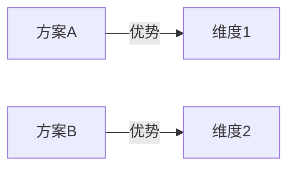

<!-- PREAMBLE_SECTION_START -->
## Preamble (run first)

```bash
_UPD=$(~/.claude/skills/cto-fleet/bin/cto-fleet-update-check 2>/dev/null || true)
[ -n "$_UPD" ] && echo "$_UPD" || true
```

If output shows `UPGRADE_AVAILABLE <old> <new>`: read `~/.claude/skills/cto-fleet/cto-fleet-upgrade/SKILL.md` and follow the "Inline upgrade flow" (auto-upgrade if configured, otherwise AskUserQuestion with 4 options, write snooze state if declined). If `JUST_UPGRADED <from> <to>`: tell user "Running cto-fleet v{to} (just updated!)" and continue.
<!-- PREAMBLE_SECTION_END -->

**参数解析**：从 `$ARGUMENTS` 中检测以下标志：
- `--auto`：完全自主模式（不询问用户任何问题，全程自动决策）
- `--once`：单轮确认模式（将所有需要确认的问题合并为一轮提问，确认后全程自动执行）
- `--depth=quick|standard|deep`：调研深度（默认 `standard`）
- `--lang=zh|en`：报告语言（默认 `zh` 中文）

| 模式 | 用户确认范围 | 条件节点处理 |
|------|-------------|-------------|
| **标准模式**（默认） | 主题确认 + 中间检查点 + 分歧仲裁 + 最终报告确认 | 正常询问用户 |
| **单轮确认模式**（`--once`） | 仅最终报告确认 | 自动决策 + 收尾汇总 |
| **完全自主模式**（`--auto`） | 不询问用户 | 全部自动决策，收尾汇总所有决策 |

单轮确认模式下条件节点自动决策规则：
- **主题范围不确定** → team lead 自行界定范围，在最终报告中说明
- **两位 researcher 分歧** → analyst 标注分歧，team lead 综合论证后裁决，收尾时汇总
- **分歧超过 50%** → **不可跳过，必须暂停问用户**（熔断机制）
- **两位 researcher 均报告"网络信息不足"** → **不可跳过，必须暂停问用户调整主题/关键词**（熔断机制）
- **critic 发现 ≥ 3 个核心结论需修正** → **不可跳过，必须暂停问用户**（熔断机制，单轮确认模式和完全自主模式均适用）

完全自主模式下：所有节点均自动决策，不询问用户。熔断机制仍然生效——触发熔断条件时是唯一会暂停询问用户的情况。

调研深度说明：

| 深度 | 调研范围 | 调研轮次 |
|------|---------|---------|
| `quick` | 快速概览，仅搜索网络热门结果，本地文档粗扫 | 仅第一轮，跳过第二轮和对抗验证 |
| `standard` | 多轮搜索 + 本地文档细读，交叉验证信息 | 两轮调研 + 对抗验证 |
| `deep` | 全面调研，额外包括学术文献、竞品对比、趋势预测 | 两轮调研 + 对抗验证 |

使用 TeamCreate 创建 team（名称格式 `team-research-{YYYYMMDD-HHmmss}`，如 `team-research-20260308-143022`，避免多次调用冲突），你作为 team lead 按以下流程协调。

<!-- HANDOFF_SECTION_START -->
## 文件交接规范（File-Based Handoff）

所有 agent 间传递详细报告时，必须采用**文件交接模式**（防止上下文溢出触发 20MB 限制）：

1. **写入文件**：将完整报告写入团队工作目录：
   - 目录路径：`/tmp/{team-name}/`（team lead 在 TeamCreate 后执行 `mkdir -p /tmp/{team-name} && chmod 700 /tmp/{team-name}`）
   - 单个文件 ≤ 2000 行；超大报告拆分为 summary + details 文件
2. **发送引用**：通过 SendMessage 仅发送（≤500 字符）：
   - 文件路径（1 行）
   - 关键摘要（含核心指标/发现/评分）
3. **按需读取**：接收方使用 Read 按需读取文件，发送方不内联完整内容
4. **路径转发**：team lead 转发报告时只转发文件路径 + 摘要，不 Read 后再 SendMessage
5. **遵从校验**：team lead 收到超 1000 字符且不含 `/tmp/team-` 路径前缀的消息时，要求 agent 以文件交接模式重发

**文件命名规范**：

| 角色输出 | 文件名 |
|---------|--------|
| Scanner 报告 | `scanner-report.md` |
| Reviewer-N 第R轮 | `reviewer-{N}-round-{R}.md` |
| 合并报告第R轮 | `merged-report-round-{R}.md` |
| 根因分组 | `root-cause-groups-round-{R}.md` |
| Fixer 第R轮 | `fixer-round-{R}.md` |
| Tester 第R轮 | `tester-round-{R}.md` |
| Architect-N 方案 | `architect-{N}-design.md` |
| 任务拆解 | `task-breakdown.md` |
| Coder-N 任务T | `coder-{N}-task-{T}.md` |
| 审查任务T | `review-task-{T}.md` |
| 集成测试第R轮 | `integration-test-round-{R}.md` |
| 最终报告 | `final-report.md` |

> 仅当角色存在于当前 skill 时使用对应命名。未列出的角色用 `{role}-{context}.md` 格式。
<!-- HANDOFF_SECTION_END -->


## 流程概览

```
阶段零  主题分解 → team lead 解析主题 → 拆分为 research questions
         ↓
阶段一  第一轮调研 → researcher-1（广度扫描）+ researcher-2（深度探索）独立并行
         ↓
阶段二  分析合并 → analyst 对比两份报告 → 输出：共识/分歧/盲区/需深化点
         ↓
阶段三  第二轮调研 → researcher-1 补充盲区 + researcher-2 深化重点（基于 analyst 反馈）
         ↓
阶段四  对抗验证 → critic 对合并结论做反面验证 + 信源可信度评估
         ↓
阶段五  报告生成 → writer 生成最终 Markdown + Mermaid 图表 → 用户确认
         ↓
阶段六  收尾 → 保存报告 + 清理团队

quick 流程：阶段零 → 阶段一 → 阶段二（精简） → 跳过阶段三和四 → 阶段五 → 阶段六
```

## 角色定义

| 角色 | 职责 |
|------|------|
| researcher-1 | 围绕 research questions 进行独立调研：网络搜索（WebSearch/WebFetch）+ 本地文档分析（Read/Glob/Grep）。**广度优先策略**：多组关键词、多角度搜索，覆盖面广。每条信息标注来源和信源等级。**独立工作，不与 researcher-2 交流。** |
| researcher-2 | 同 researcher-1 的职责，独立执行调研。**深度优先策略**：少量精准关键词、对重点来源深入阅读分析。每条信息标注来源和信源等级。**独立工作，不与 researcher-1 交流。** |
| analyst | 对比两位 researcher 的报告，输出结构化分析：共识清单、互补清单、分歧清单、盲区清单（未覆盖的 RQ）、需深化清单。**只做分析，不写最终报告，不自行搜索。** 根本性矛盾必须标注为"待仲裁"升级 team lead。 |
| critic | 对 analyst 的合并结论进行对抗验证：主动搜索反面证据和反例，评估信源可信度，标注每个核心结论的置信等级（高/中/低）。**只做挑战和验证，不做建设性补充。** |
| writer | 基于 analyst 的分析结果、仲裁结论和 critic 的验证报告，生成最终调研报告和 Mermaid 图表。**不做分析判断，不自行搜索。** |

## 信源可信度分级

Researcher 在报告中为每条信息标注信源等级，analyst 和 critic 在分析时考虑权重：

| 等级 | 来源类型 | 权重 |
|------|---------|------|
| **S** | 官方文档、RFC/规范、一手数据/实验 | 最高 |
| **A** | 同行评审论文、权威技术报告 | 高 |
| **B** | 知名技术博客、会议演讲、成熟开源项目文档 | 中 |
| **C** | 社区讨论、个人博客、问答网站 | 低 |
| **D** | 未标注来源、AI 生成内容、过时信息（>2年） | 不采纳 |

信源等级冲突时，高等级来源优先。两个同等级来源矛盾时，标注为分歧待仲裁。

---

## 阶段零：主题分解

### 步骤 1：解析调研主题

Team lead 解析 `$ARGUMENTS` 中的调研主题：
- 提取核心关键词和搜索方向
- 检查本地工作目录是否有相关文档（扫描当前目录和 `~/Documents`）
- 确定报告语言（`--lang` 参数或默认中文）

### 步骤 2：拆分 Research Questions

将调研主题分解为 3-7 个具体的 research questions（RQ），每个 RQ 必须：
- 可独立回答
- 有明确的调研方向
- 标注建议搜索策略：广度（对比类）或深度（原理类）

示例：
```
主题："Rust vs Go 用于后端微服务"
RQ1: 性能基准对比（计算密集/IO密集/并发）→ 广度
RQ2: 生态系统成熟度（框架/库/工具链）→ 广度
RQ3: 团队学习曲线和招聘市场 → 广度
RQ4: 生产环境案例和踩坑经验 → 深度
RQ5: 长期维护成本对比 → 深度
```

### 步骤 3：确认调研范围

- 如果主题明确 → 直接进入阶段一
- 如果主题模糊或过于宽泛：
  - **标准模式**：向用户展示 RQ 列表和调研策略，AskUserQuestion 确认范围和重点
  - **单轮确认模式**：team lead 自行界定范围，收尾时说明
  - **完全自主模式**：自动决策，不询问用户

---

## 阶段一：第一轮调研

### 步骤 4：启动 researcher-1 和 researcher-2

两者并行启动，全程保持存活直到收尾。Team lead 将 RQ 列表发给两位 researcher，两者独立调研所有 RQ。

**Researcher-1（广度优先）**：
- 每个 RQ 用 2-3 组不同关键词搜索（WebSearch），覆盖不同角度
- 粗扫本地文档目录，识别相关文件列表
- 对搜索结果中的关键页面用 WebFetch 获取详细内容（每个 RQ 选取 2-3 个最相关页面）
- 每条信息标注来源 URL/路径 + 信源等级（S/A/B/C/D）
- 输出：按 RQ 组织的发现列表 + 来源索引 + 关键摘要

**Researcher-2（深度优先）**：
- 每个 RQ 用 1 组精准关键词搜索
- 对搜索结果中的重点页面深入阅读（WebFetch 全文提取，每个 RQ 选 1-2 个核心页面逐段分析）
- 深入分析本地相关文档（Read 全文阅读）
- 每条信息标注来源 URL/路径 + 信源等级（S/A/B/C/D）
- 输出：按 RQ 组织的深度分析报告 + 来源索引 + 详细论述

**搜索终止条件**：每位 researcher 单次搜索如果返回无关结果，调整关键词重试，单个方向最多重试 3 轮。3 轮后仍无结果则标注"该方向网络信息不足"并继续其他 RQ。

`deep` 模式额外调研：
- 学术文献搜索（Google Scholar 等）
- 竞品/替代方案对比
- 行业趋势和发展预测

### 步骤 5：收集报告

两者完成后各自向 team lead 发送报告。Team lead 确认收到全部 2 份报告后，进入阶段二。

---

## 阶段二：分析合并

### 步骤 6：启动 analyst

Team lead 启动 analyst，将以下内容传递：
- RQ 列表
- Researcher-1 的调研报告（标记为"研究员 A"）
- Researcher-2 的调研报告（标记为"研究员 B"）

**重要**：传递时不透露 researcher 编号，仅用"研究员 A"和"研究员 B"标记，避免暗示优先级。

### 步骤 7：Analyst 对比分析

Analyst 按 RQ 逐项对比两份报告，输出结构化分析结果：

| 对比结果 | 处理方式 |
|---------|---------|
| **一致结论** | 直接采纳，标记为"共识" |
| **互补发现**（A 发现了 B 没注意的点，或反之） | 合并，标记为"互补" |
| **措辞/粒度差异**（本质相同，表述不同） | 合并最佳表述，标记为"共识" |
| **分歧/矛盾**（对同一问题有不同结论） | 标注为"待仲裁"，记录双方观点和来源 |

Analyst 输出 5 份清单：
1. **共识清单**：双方一致的核心结论
2. **互补清单**：一方独有的有价值发现
3. **分歧清单**：矛盾之处及双方来源对比
4. **盲区清单**：两人都未充分覆盖的 RQ 或角度
5. **深化清单**：初步结论不够深入、需要更多证据的点

附带：
- **共识度评估**：共识度 = (共识发现数 + 互补发现数) / 总发现数(去重并集) × 100%
- **信源质量初评**：标注主要依赖的信源等级分布

### 步骤 8：检查熔断条件

如果共识度 < 50%（分歧占比超过一半）：
- **必须暂停**，team lead 向用户报告情况
- 可能原因：主题理解有偏差、搜索方向不同、主题过于宽泛
- 建议：明确调研范围或拆分子主题

共识度 ≥ 50%：继续。

### 步骤 9：中间检查点

- **标准模式**：team lead 向用户展示初步发现摘要（共识结论 + 盲区清单 + 深化清单），AskUserQuestion 确认调研方向是否正确、是否需要调整 RQ
- **单轮确认模式**：跳过，直接进入阶段三
- **完全自主模式**：自动决策，不询问用户

### 步骤 10：分歧仲裁

如果分歧清单为空 → 跳过仲裁。

Team lead 对分歧清单中的每个分歧点：
1. 将分歧描述分别发给 researcher-1 和 researcher-2，要求各自提供论证：
   - 你的结论是什么？
   - 依据哪些来源（附 URL/路径和信源等级）？
   - 为什么你认为对方的结论不准确？
2. 收到双方论证后：
   - **标准模式**：team lead 向用户展示分歧摘要和双方论证，AskUserQuestion 让用户裁决
   - **单轮确认模式**：team lead 综合双方论证和信源等级自行裁决
   - **完全自主模式**：自动决策，不询问用户
3. 将仲裁结果发送给 analyst 更新分析

---

## 阶段三：第二轮调研

**`quick` 模式跳过此阶段。**

基于 analyst 的盲区清单和深化清单，两位 researcher 进行定向二次调研。

### 步骤 11：分配二次调研任务

Team lead 根据 analyst 的分析结果，分配任务：
- **Researcher-1**：针对盲区清单中的 RQ 做补充调研（广度扫描）
- **Researcher-2**：针对深化清单中的点做专项深钻（深度挖掘）

如果盲区清单或深化清单为空，对应 researcher 无需二次调研。

### 步骤 12：二次调研执行

Researcher 按分配的方向做定向调研：
- 搜索策略更聚焦，关键词更精准
- 重点关注第一轮遗漏的角度和来源
- 同样标注来源和信源等级
- 完成后将补充报告发送给 team lead

### 步骤 13：Analyst 更新分析

Team lead 将补充报告发送给 analyst。Analyst 将新发现整合到已有分析中，更新共识清单、互补清单，重新评估共识度。输出**合并分析报告**（整合两轮调研的完整结果）。

---

## 阶段四：对抗验证

**`quick` 模式跳过此阶段。**

### 步骤 14：启动 critic

Team lead 启动 critic，将以下内容传递：
- Analyst 的合并分析报告（含所有核心结论）
- 仲裁结果（如有）

### 步骤 15：Critic 对抗验证

Critic 对每个核心结论执行：

1. **反面搜索**：针对结论主动搜索反面证据、反例、争议观点（WebSearch/WebFetch）
2. **信源交叉验证**：检查关键结论是否仅依赖单一来源或低等级来源
3. **时效性检查**：核心数据/结论是否过时
4. **置信度标注**：

| 置信等级 | 判断标准 |
|---------|---------|
| **高** | 多个 S/A 级来源支持，未找到有力反证 |
| **中** | 有 B 级及以上来源支持，但存在部分反面证据或来源单一 |
| **低** | 仅有 C 级来源，或存在有力反证，或信息过时 |

Critic 输出：
1. **验证报告**：每个核心结论的置信等级 + 理由
2. **修正建议**：需修正的结论（附反面证据来源）
3. **补充发现**：对抗搜索中意外发现的重要信息

### 步骤 16：检查熔断条件

如果 critic 发现 ≥ 3 个核心结论需修正：
- **必须暂停**，team lead 向用户报告情况，可能调研方向存在系统性偏差
- 建议：调整 RQ 或补充调研

否则：team lead 将修正建议发给 analyst 更新分析，继续下一阶段。

---

## 阶段五：报告生成

### 步骤 17：启动 writer 生成最终报告

Team lead 启动 writer，将以下内容传递：
- Analyst 的最终合并分析报告
- Critic 的验证报告（含置信等级标注）
- 仲裁结果（如有）
- RQ 列表
- `--lang` 参数

Writer 按指定语言生成最终调研报告。文档格式：

```markdown
# [调研主题] 调研报告

> 生成时间：YYYY-MM-DD | 调研深度：quick|standard|deep | 共识度：XX%

## 1. 摘要
[200-300 字的调研主题概述和核心结论]

## 2. 背景
[主题的背景知识、历史沿革、行业/技术现状]

## 3. 核心发现

### 3.1 [RQ1 对应的子主题]
[详细分析] | 置信度：高/中/低

### 3.2 [RQ2 对应的子主题]
[详细分析] | 置信度：高/中/低

## 4. 对比分析（如适用）

| 维度 | 方案 A | 方案 B | 方案 C |
|------|--------|--------|--------|
| [维度] | [评价] | [评价] | [评价] |



## 5. 趋势与展望（standard/deep 模式）
[行业趋势、技术发展方向、预测]

## 6. 结论与建议
| 结论 | 置信度 | 关键支撑来源 |
|------|--------|-------------|
| [结论 1] | 高/中/低 | [来源] |
| [结论 2] | 高/中/低 | [来源] |

### 行动建议
1. [建议 1]
2. [建议 2]

## 7. 参考来源
| 序号 | 来源 | 类型 | 信源等级 | URL/路径 |
|------|------|------|---------|---------|
| 1 | [来源名] | 网络/本地 | S/A/B/C | [链接] |

## 附录 A：调研共识说明

### 共识结论
[两位研究员一致的核心结论列表]

### 分歧点及仲裁结果
| 分歧点 | 研究员 A 观点 | 研究员 B 观点 | 仲裁结果 | 理由 |
|--------|-------------|-------------|---------|------|
| [描述] | [观点] | [观点] | [结论] | [理由] |

## 附录 B：对抗验证说明

### 置信度评估
| 核心结论 | 置信度 | 支撑来源数 | 反面证据 |
|---------|--------|-----------|---------|
| [结论] | 高/中/低 | [数量] | [有/无，简述] |

### Critic 修正记录
| 原结论 | 修正后 | 反面证据来源 |
|--------|--------|-------------|
| [原文] | [修正] | [来源] |
```

**注意**：每张 Mermaid 图不超过 15 个节点。如果内容复杂，分多张图展示。

### 步骤 18：用户确认

Team lead 向用户展示报告摘要：
- 调研主题和 RQ 覆盖情况
- 核心结论（3-5 条）及置信等级
- 共识度
- Critic 验证结果（修正数量、低置信结论数）
- 参考来源数量和信源等级分布

AskUserQuestion 确认：
- 接受报告
- 需要补充某些方面的调研
- 需要调整某些结论

**单轮确认模式**：必须经用户确认。

**完全自主模式**：自动决策，不询问用户，收尾时汇总。

---

## 阶段六：收尾

### 步骤 19：保存报告

将最终调研报告保存到项目的 `docs/research/` 目录：
- 文件名：`research-YYYY-MM-DD-<topic>.md`
- 如果目录不存在，创建之

### 步骤 20：最终总结

Team lead 向用户输出：
- 调研了什么（主题、RQ 列表、深度）
- 核心发现摘要及置信等级
- 共识度和分歧处理情况
- Critic 验证结果概要
- 报告保存位置
- **（单轮确认模式/完全自主模式）自动决策汇总**：列出所有自动决策的节点、决策内容和理由

### 步骤 21：清理

关闭所有 teammate，用 TeamDelete 清理 team。

---

## 核心原则

- **问题驱动**：先分解 research questions，再围绕 RQ 调研，确保不遗漏
- **两轮迭代**：第一轮探索发现盲区，第二轮定向深化，螺旋式提升质量
- **独立调研**：两位 researcher 必须完全独立工作，不互相看到对方结果，确保共识的客观性
- **对抗验证**：critic 主动寻找反面证据，防止虚假共识和信源偏差
- **信源分级**：所有信息标注来源和可信度等级，高等级来源优先
- **职责分离**：analyst 只分析不写报告，critic 只挑战不建设，writer 只写作不判断
- **有限调研**：根据 depth 参数控制调研范围和轮次，避免无限发散

---

### 共识度计算

team lead 按五维度评估双路分析的共识度：

| 维度 | 权重 |
|------|------|
| 调研结论一致性（相同问题/结论） | 20% |
| 互补性（独有但不矛盾的调研结论） | 20% |
| 分歧程度（直接矛盾的结论） | 20% |
| 严重度一致性（同一问题的严重等级差异） | 20% |
| 覆盖完整性（两路合并后的覆盖面） | 20% |

共识度 = 各维度加权得分之和

- **≥ 60%**：自动合并，分歧项由 team lead 裁决
- **50-59%**：合并但标注分歧，收尾时汇总争议点
- **< 50%**：触发熔断，暂停并向用户确认方向

---

## 错误处理

| 异常情况 | 处理方式 |
|---------|---------|
| 主题过于宽泛 | Team lead 拆分为具体 RQ，标准模式请用户确认 |
| 网络搜索无有效结果 | Researcher 调整关键词重试，最多 3 轮；仍无结果标注"网络信息不足" |
| 本地无相关文档 | Researcher 标注"无本地资料"，仅基于网络信息 |
| 两位 researcher 调研差异极大（共识度 < 50%） | 触发熔断，暂停问用户确认调研方向 |
| Critic 发现 ≥ 3 个核心结论需修正 | 触发熔断，暂停问用户确认是否存在系统性偏差 |
| WebFetch 目标页面无法访问 | Researcher/critic 跳过该来源，标注为"无法访问" |
| 信息来源相互矛盾 | Analyst 标注矛盾，列出各方观点和来源等级，升级仲裁 |
| 搜索结果主要为非目标语言 | Researcher 尝试添加语言限定关键词重新搜索 |
| Analyst 盲区/深化清单均为空 | 跳过第二轮调研，直接进入对抗验证 |
| Teammate 无响应/崩溃 | Team lead 重新启动同名 teammate（传入完整上下文），从当前阶段恢复。如果是 researcher 崩溃，检查已发送的部分报告决定是否需要重新调研。 |

---

## 需求

$ARGUMENTS

<!-- ERROR_HANDLING_SECTION_START -->
### 错误处理

| 场景 | 处理方式 |
|------|---------|
| Teammate 无响应/崩溃 | Team lead 重新启动同名 teammate（传入完整上下文），从最近的检查点恢复 |
| 某阶段产出质量不达标 | 记录问题，在收尾阶段汇总，不阻塞后续流程（除非是熔断条件） |
| 用户中途修改需求 | 暂停当前阶段，重新评估影响范围，必要时回退到受影响的最早阶段 |

### 熔断机制（不可跳过）

以下条件触发时，**无论 `--auto` 还是 `--once` 模式，都必须暂停并向用户确认**：

- 共识度 < 50%（双路分析严重分歧）
- 迭代超过最大轮数仍未达标
- 关键依赖缺失（无法继续执行的前置条件不满足）

触发熔断时，向用户展示：当前状态、分歧/问题摘要、建议的下一步选项。
<!-- ERROR_HANDLING_SECTION_END -->

