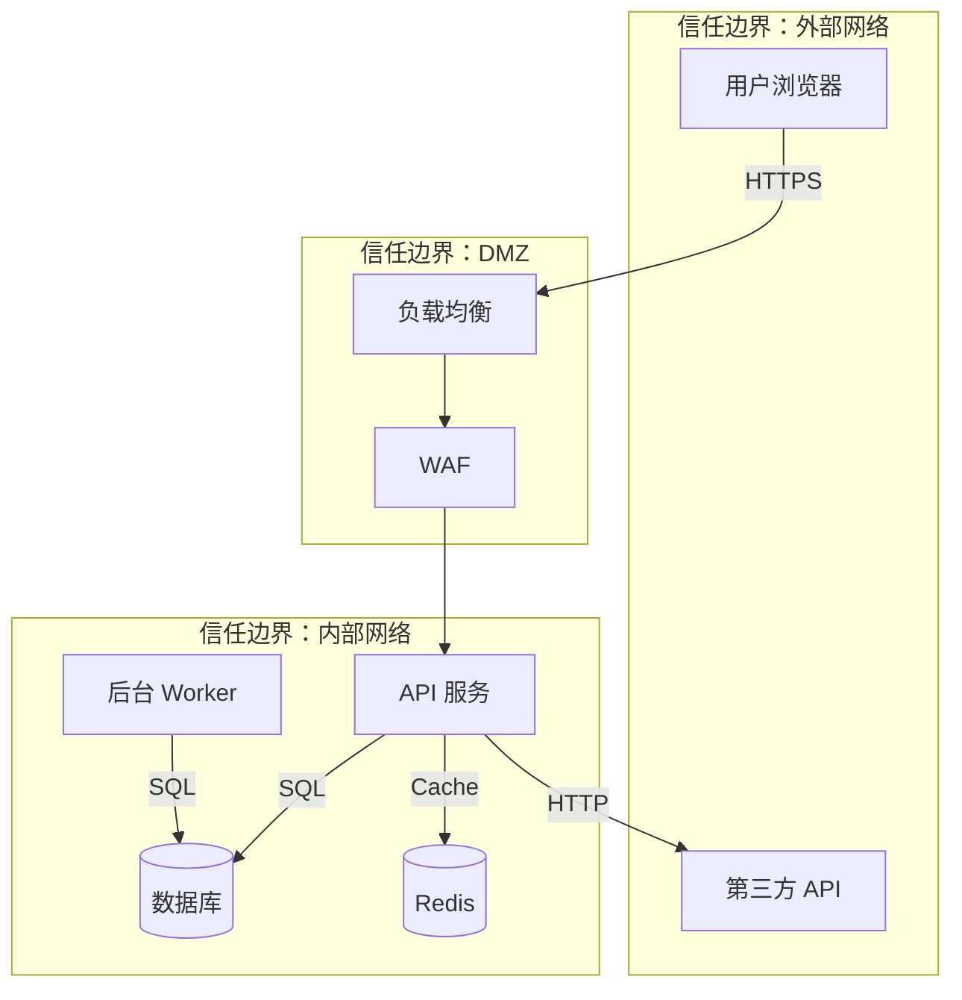

## Preamble (run first)

```bash
_UPD=$(~/.claude/skills/cto-fleet/bin/cto-fleet-update-check 2>/dev/null || true)
[ -n "$_UPD" ] && echo "$_UPD" || true
```

If output shows `UPGRADE_AVAILABLE <old> <new>`: read `~/.claude/skills/cto-fleet/cto-fleet-upgrade/SKILL.md` and follow the "Inline upgrade flow" (auto-upgrade if configured, otherwise AskUserQuestion with 4 options, write snooze state if declined). If `JUST_UPGRADED <from> <to>`: tell user "Running cto-fleet v{to} (just updated!)" and continue.

---

**参数解析**：从 `$ARGUMENTS` 中检测以下标志：
- `--auto`：完全自主模式（不询问用户任何问题，全程自动决策）
- `--once`：单轮确认模式（将所有需要确认的问题合并为一轮提问，确认后全程自动执行）
- `--framework=stride|dread|both`：威胁建模框架（可选，默认 `both`）
- `--scope=system|component|api`：建模范围（可选，默认 `system`）
- `--lang=zh|en`：输出语言（默认 `zh` 中文）

解析后将标志从建模需求描述中移除。

**建模范围说明**：
- `system`：整体系统威胁建模（架构层面，所有组件和数据流）
- `component`：特定组件威胁建模（聚焦指定模块/服务的内部威胁）
- `api`：API 层面威胁建模（聚焦 API 端点的攻击面分析）

| 模式 | 用户确认范围 | 条件节点处理 |
|------|-------------|-------------|
| **标准模式**（默认） | 建模范围确认 + 最终报告确认 | 正常询问用户 |
| **单轮确认模式**（`--once`） | 仅最终报告确认 | 自动决策 + 收尾汇总 |
| **完全自主模式**（`--auto`） | 不询问用户 | 全部自动决策，收尾汇总所有决策 |

单轮确认模式下自动决策规则：
- **威胁分类不确定** → 对应 modeler 自行判断，报告中说明
- **两位 modeler 对同一威胁的风险评级差异过大（DREAD 评分差 ≥ 3）** → **不可跳过，必须暂停问用户**（熔断机制）
- **高危（Critical）威胁超过 10 个** → **不可跳过，必须暂停问用户**（熔断机制）
- **架构信息不完整（缺少部署拓扑）** → scanner 标注"信息不完整"，基于可用信息建模
- **威胁数量超出预期（> 50 个）** → assessor 自行决定是否分组聚合

完全自主模式下：所有节点均自动决策，不询问用户。熔断机制仍然生效（评级差异过大、高危威胁超过 10 个时仍必须暂停问用户）。

使用 TeamCreate 创建 team（名称格式 `team-threat-model-{YYYYMMDD-HHmmss}`，如 `team-threat-model-20260308-143022`，避免多次调用冲突），你作为 team lead 按以下流程协调。

## 流程概览

```
阶段零  架构分析 + 范围确认 → 识别系统架构、信任边界、数据流、攻击面，确认建模目标
         ↓
阶段一  架构扫描 + 双路独立威胁建模（并行）
         ├─ scanner：架构扫描（组件发现、数据流映射、信任边界识别、已有安全控制检测）
         ├─ modeler-1：STRIDE 威胁识别（按六类威胁逐组件分析攻击路径）
         └─ modeler-2：DREAD 风险评估（按五维度量化每个威胁的风险等级）
         ↓
阶段二  威胁合并 → assessor 合并两份模型，交叉校验，输出统一威胁清单 + 优先级排序
         → 熔断检查（评级差异过大 / 高危威胁 > 10）
         ↓
阶段三  缓解方案 → writer 生成威胁模型文档 + 安全加固路线图
         ↓
阶段四  保存报告 + 清理团队
```

## 角色定义

| 角色 | 职责 |
|------|------|
| scanner | 识别系统架构（组件、服务、数据库、外部依赖），映射数据流（数据如何在组件间流动），识别信任边界（内外网边界、服务间认证边界、权限分层），检测已有安全控制（认证、加密、日志、WAF），输出架构和攻击面数据。**仅在扫描阶段工作，完成后关闭。** |
| modeler-1 | **STRIDE 威胁识别**：按 STRIDE 六类威胁（Spoofing/Tampering/Repudiation/Information Disclosure/Denial of Service/Elevation of Privilege），逐组件、逐数据流分析潜在攻击路径和威胁场景。关注"系统可能受到哪些类型的攻击"。**不修改代码。独立建模，不与 modeler-2 交流。** |
| modeler-2 | **DREAD 风险评估**：按 DREAD 五维度（Damage/Reproducibility/Exploitability/Affected Users/Discoverability），对每个识别的威胁进行量化评分（1-10），计算风险等级。关注"每个威胁的实际风险有多高"。**不修改代码。独立建模，不与 modeler-1 交流。** |
| assessor | 合并 STRIDE 威胁清单和 DREAD 评分，交叉校验，统一优先级排序，识别缺失的威胁覆盖，输出统一威胁评估清单。**不直接阅读代码，只对比和合并模型。完成后关闭。** |
| writer | 基于统一威胁评估清单生成威胁模型文档（含数据流图、威胁清单、缓解方案、安全加固路线图），按 `--lang` 语言输出。**完成后关闭。** |

### 角色生命周期

| 角色 | 启动阶段 | 关闭时机 | 说明 |
|------|---------|---------|------|
| scanner | 阶段一（步骤 3） | 阶段一扫描完成后（步骤 3） | 扫描报告交付后即释放 |
| modeler-1 | 阶段一（步骤 3，与 scanner 并行） | 阶段一建模完成后（步骤 5） | 威胁模型交付后释放 |
| modeler-2 | 阶段一（步骤 3，与 scanner 并行） | 阶段一建模完成后（步骤 5） | 风险评估交付后释放 |
| assessor | 阶段二（步骤 6） | 阶段二合并完成后（步骤 9） | 统一威胁评估清单输出后释放 |
| writer | 阶段三（步骤 10） | 阶段三报告生成后（步骤 12） | 报告确认后释放 |

---

## STRIDE 威胁分类

| 类别 | 全称 | 含义 | 违反的安全属性 | 典型攻击示例 |
|------|------|------|-------------|-------------|
| **S** | Spoofing | 身份伪造 | 认证（Authentication） | 伪造 JWT、会话劫持、凭证填充 |
| **T** | Tampering | 数据篡改 | 完整性（Integrity） | SQL 注入、参数篡改、中间人攻击 |
| **R** | Repudiation | 抵赖 | 不可否认性（Non-repudiation） | 日志缺失、审计绕过、操作不可追溯 |
| **I** | Information Disclosure | 信息泄露 | 机密性（Confidentiality） | 敏感数据暴露、错误信息泄露、侧信道攻击 |
| **D** | Denial of Service | 拒绝服务 | 可用性（Availability） | DDoS、资源耗尽、慢速攻击、正则 ReDoS |
| **E** | Elevation of Privilege | 权限提升 | 授权（Authorization） | IDOR、水平/垂直越权、SSRF、反序列化 |

---

## DREAD 评分维度

| 维度 | 全称 | 评分标准（1-10） | 低分（1-3） | 中分（4-6） | 高分（7-10） |
|------|------|---------------|-----------|-----------|------------|
| **D** | Damage | 攻击成功后的损害程度 | 最小影响 | 用户数据泄露 | 完全系统接管 |
| **R** | Reproducibility | 攻击可重现性 | 极难重现 | 特定条件下重现 | 随时可重现 |
| **E** | Exploitability | 攻击难度 | 需要高级技能 | 需要中等技能 | 初学者即可利用 |
| **A** | Affected Users | 受影响用户范围 | 个别用户 | 部分用户 | 所有用户 |
| **D** | Discoverability | 攻击可发现性 | 极难发现 | 需要分析才能发现 | 显而易见 |

**DREAD 总分 = (D + R + E + A + D) / 5**

| DREAD 总分 | 风险等级 | 处理优先级 |
|-----------|---------|-----------|
| 8.0 - 10.0 | **Critical（致命）** | P0 - 立即处理 |
| 6.0 - 7.9 | **High（高危）** | P1 - 尽快处理 |
| 4.0 - 5.9 | **Medium（中危）** | P2 - 计划处理 |
| 1.0 - 3.9 | **Low（低危）** | P3 - 择机处理 |

---

## 阶段零：架构分析 + 范围确认

### 步骤 1：解析建模范围

Team lead 分析项目和参数：

1. 解析 `--framework` 参数，确定威胁建模框架（`stride`/`dread`/`both`）
2. 解析 `--scope` 参数，确定建模范围（`system`/`component`/`api`）
3. 阅读项目结构，识别系统架构：
   - 组件清单（前端、后端、数据库、缓存、消息队列、第三方服务）
   - 部署架构（容器、K8s、云服务、CDN、负载均衡）
   - 数据流方向（用户→前端→后端→数据库→外部 API）
   - 认证与授权机制（OAuth、JWT、Session、API Key）
   - 加密使用（TLS、数据加密、密钥管理）
   - 现有安全控制（WAF、CORS、CSP、速率限制）
4. 识别信任边界：
   - 外部网络 ↔ DMZ
   - DMZ ↔ 内部网络
   - 服务 ↔ 服务（mTLS/Token）
   - 用户 ↔ 管理员（权限分层）
5. 输出架构概览和建模范围清单

### 步骤 2：用户确认建模范围

**标准模式**：向用户展示架构概览和建模范围，AskUserQuestion 确认：
- 确认建模框架和范围
- 补充架构信息（部署环境、外部依赖、安全要求）
- 调整关注重点（特定组件/数据流）

**单轮确认模式**：跳过确认，直接进入阶段一。
**完全自主模式**：自动决策，不询问用户，直接进入阶段一。

---

## 阶段一：架构扫描 + 双路威胁建模

### 步骤 3：启动 scanner 和双 modeler

三者并行启动。

**Scanner 架构扫描**：
1. 扫描项目，识别所有组件和入口点：
   - Web 服务端点（路由、控制器、API 网关）
   - 数据存储（数据库连接、文件存储、缓存）
   - 外部集成（第三方 API、Webhook、OAuth Provider）
   - 后台任务（定时任务、消息消费者、Worker）
2. 映射数据流：
   - 输入数据流（用户输入、API 请求、文件上传、Webhook）
   - 处理数据流（业务逻辑、数据转换、缓存读写）
   - 输出数据流（API 响应、数据库写入、外部 API 调用、日志）
   - 敏感数据流（PII、凭证、支付信息、密钥）
3. 识别信任边界和已有安全控制
4. 输出**架构扫描报告**（含组件清单、数据流图、信任边界、安全控制现状）
5. Scanner 完成后关闭

**双 modeler 同时阅读项目**：
- 阅读项目结构（架构、代码、配置、部署文件）
- 理解系统数据流和信任边界
- 梳理各自负责维度的建模要点
- 各自输出项目安全概况给 team lead

### 步骤 4：分发 scanner 报告

Team lead 收到 scanner 报告后，将架构数据分发给两位 modeler，作为威胁建模的基础输入。

Modeler 在建模时必须参考 scanner 结果——例如 scanner 识别的数据流和信任边界是威胁分析的核心输入。

### 步骤 5：独立并行威胁建模

两位 modeler 各自从不同维度建模，**互不交流**。

**Modeler-1（STRIDE 威胁识别）**：

按组件和数据流逐项分析六类威胁：

| STRIDE 类别 | 分析方法 | 具体检查项 |
|------------|---------|-----------|
| **Spoofing** | 每个认证点的伪造可能性 | 认证机制强度、Token 安全（JWT 签名/过期/刷新）、Session 管理（固定/劫持/预测）、API Key 泄露风险、OAuth 流程安全（CSRF/重定向劫持）、WebSocket 认证 |
| **Tampering** | 每个数据输入点的篡改可能性 | 输入验证缺失（SQL/NoSQL/命令/XSS/SSRF 注入）、参数篡改（价格/数量/权限字段）、请求重放、Cookie 篡改、文件上传内容篡改、数据库直接写入 |
| **Repudiation** | 每个关键操作的审计覆盖 | 日志记录缺失（登录/登出/权限变更/数据修改）、审计追踪不完整（缺少操作者/时间/结果）、日志可篡改（无保护/无签名）、敏感操作无确认 |
| **Info Disclosure** | 每个数据输出点的泄露可能性 | 错误消息泄露（堆栈/SQL/路径）、API 响应过度暴露（GraphQL introspection/verbose error）、日志中的敏感数据、源码泄露（.git/.env）、侧信道（时间差/错误差异） |
| **Denial of Service** | 每个资源消耗点的耗尽可能性 | 无速率限制、大文件上传无限制、正则 ReDoS、数据库慢查询、递归/循环无上限、连接池耗尽、缓存穿透/击穿 |
| **Elevation of Privilege** | 每个权限检查点的绕过可能性 | IDOR（不安全的直接对象引用）、水平越权（访问他人数据）、垂直越权（普通用户执行管理操作）、SSRF（服务端请求伪造）、不安全的反序列化、路径遍历 |

- 每个威胁输出：STRIDE 类别 + 威胁场景描述 + 攻击路径 + 受影响组件 + 前提条件 + 影响描述

**Modeler-2（DREAD 风险评估）**：

对每个识别的威胁点进行五维量化评分：

| DREAD 维度 | 评估方法 | 具体评估内容 |
|-----------|---------|-------------|
| **Damage** | 攻击成功后的业务影响 | 数据丢失/泄露范围、服务中断时间、声誉损害、法律/合规后果、财务损失 |
| **Reproducibility** | 攻击重现的难度 | 是否需要特定条件（时间窗口/竞态）、是否依赖用户交互、是否需要内部信息、攻击是否确定性可重现 |
| **Exploitability** | 发起攻击的技术门槛 | 是否有公开 PoC/工具、是否需要认证、是否需要特殊权限、攻击复杂度 |
| **Affected Users** | 受影响的用户/服务范围 | 影响所有用户还是特定用户、影响核心功能还是边缘功能、是否影响其他服务（爆炸半径） |
| **Discoverability** | 攻击面的可发现性 | 是否在公开 API/文档中暴露、是否需要源码访问才能发现、是否可通过自动化扫描发现 |

- 每个威胁输出：威胁描述 + D/R/E/A/D 各维度评分（1-10） + DREAD 总分 + 风险等级 + 评分理由

---

## 阶段二：威胁合并与评估

### 步骤 6：启动 assessor

两位 modeler 建模完成后，启动 assessor。Team lead 将以下材料发送给 assessor：
- Scanner 架构扫描报告
- Modeler-1 STRIDE 威胁清单
- Modeler-2 DREAD 风险评估
- 建模范围信息

### 步骤 7：合并去重与交叉校验

Assessor 执行合并分析：

1. **威胁对齐**：将 modeler-1 的 STRIDE 威胁与 modeler-2 的 DREAD 评分按威胁场景对齐
2. **去重**：合并描述相同攻击的不同条目
3. **交叉校验**：
   - modeler-1 识别的威胁是否都有 modeler-2 的 DREAD 评分
   - modeler-2 评分的威胁是否都有 modeler-1 的 STRIDE 分类
   - 识别单方遗漏的威胁
4. **补充评估**：对单方遗漏的威胁补充分类或评分
5. **优先级排序**：按 DREAD 总分从高到低排序

**共识度计算公式**：
```
共识威胁数 = 两位 modeler 都独立识别的威胁数量（描述相同攻击场景且影响相同组件）
总威胁数 = 去重后的威胁总数

共识度 = 共识威胁数 / 总威胁数 × 100%

评级一致性 = 两位 modeler 对同一威胁的 DREAD 评分差 < 2 的比例
争议率 = DREAD 评分差 ≥ 3 的威胁数 / 两位 modeler 都识别的威胁数 × 100%

争议率 > 50% → 触发熔断，必须暂停问用户
```

### 步骤 8：差异校验与熔断检查

**评级差异熔断**：
- 如果两位 modeler 对同一威胁的 DREAD 评分差 ≥ 3（如一方评 8.0、另一方评 5.0），assessor 标注为"争议项"
- 争议项占比 > 50% → **不可跳过，必须暂停问用户**（熔断机制）

**高危威胁熔断**：
- 统一威胁清单中 Critical（DREAD ≥ 8.0）威胁超过 10 个 → **不可跳过，必须暂停问用户**（熔断机制）
- 向用户展示高危威胁列表，确认优先级和处理策略

**无熔断触发**时，assessor 输出**统一威胁评估清单**：

```
## 统一威胁评估清单

### 威胁统计
- 总威胁数: X | Critical: X | High: X | Medium: X | Low: X
- STRIDE 分布: S-X / T-X / R-X / I-X / D-X / E-X

### 威胁清单（按 DREAD 总分排序）

#### T-001 [Critical] SQL 注入导致数据泄露 — STRIDE: T+I | DREAD: 8.4
  ├─ 攻击路径: 用户输入 → /api/search?q= → 数据库查询（无参数化）
  ├─ 受影响组件: SearchController, UserRepository
  ├─ DREAD 评分: D=9 R=8 E=8 A=9 D=8 → 8.4
  ├─ 前提条件: 无需认证
  ├─ 现有控制: 无
  └─ 来源: modeler-1(STRIDE-T/I) + modeler-2(DREAD)

#### T-002 [High] IDOR 越权访问用户数据 — STRIDE: E | DREAD: 7.2
  └─ ...

### 争议项（如有）
1. 威胁:组件 — modeler-1 评估: DREAD X.X / modeler-2 评估: DREAD Y.Y — assessor 最终评估: Z.Z — 理由
```

Assessor 完成后关闭。

### 步骤 9：威胁评估评分

Team lead 根据统一威胁评估清单计算安全态势评分：

评分规则：
- 基础分 10.0，按威胁扣分
- Critical 威胁：每个扣 2.0 分（最多扣至 0 分）
- High 威胁：每个扣 1.0 分
- Medium 威胁：每个扣 0.5 分
- Low 威胁：每个扣 0.2 分

按 STRIDE 类别分组计算各维度评分，输出总体安全态势评分。

---

## 阶段三：缓解方案与报告生成

### 步骤 10：启动 writer

Team lead 将以下材料发送给 writer：
- 统一威胁评估清单
- 安全态势评分
- 架构扫描报告
- 输出语言（`--lang`）

### 步骤 11：生成威胁模型文档

Writer 生成结构化威胁模型文档：

```
## 威胁模型文档

### 元信息
- 生成时间：YYYY-MM-DD HH:mm:ss
- 团队名称：team-threat-model-{YYYYMMDD-HHmmss}
- 执行模式：标准模式 / 单轮确认模式 / 完全自主模式
- 输出语言：zh / en
- 建模框架：STRIDE / DREAD / STRIDE+DREAD
- 建模范围：system / component / api
- 建模参数：--framework=[framework 值] --scope=[scope 值]

### 1. 系统概述
- 建模日期：YYYY-MM-DD
- 系统描述：[系统功能和架构概述]
- 技术栈：[语言/框架/数据库/中间件/云服务]
- 部署架构：[部署环境描述]

### 2. 数据流图（DFD）
[Mermaid 格式数据流图，标注信任边界]


### 3. 安全态势评分
| STRIDE 类别 | 威胁数 | 最高风险 | 评分 |
|------------|--------|---------|------|
| Spoofing | X | Critical/High/Medium/Low | X.X/10 |
| Tampering | X | ... | X.X/10 |
| Repudiation | X | ... | X.X/10 |
| Info Disclosure | X | ... | X.X/10 |
| Denial of Service | X | ... | X.X/10 |
| Elevation of Privilege | X | ... | X.X/10 |
| **总评** | **X** | | **X.X/10** |

### 4. 威胁详情（按优先级排序）

#### Critical 威胁
| # | ID | STRIDE | 威胁描述 | DREAD | 受影响组件 | 攻击路径 | 现有控制 | 缓解方案 |
|---|----|--------|---------|-------|-----------|---------|---------|---------|
| 1 | T-001 | T+I | SQL 注入 | 8.4 | SearchController | 用户输入→查询 | 无 | 参数化查询+ORM |

#### High 威胁
| # | ID | STRIDE | 威胁描述 | DREAD | 受影响组件 | 攻击路径 | 现有控制 | 缓解方案 |
|---|----|--------|---------|-------|-----------|---------|---------|---------|

#### Medium 威胁
...

#### Low 威胁
...

### 5. 攻击面分析
| 攻击面 | 端点/组件数 | 暴露程度 | 主要威胁 |
|--------|-----------|---------|---------|
| 公开 API | X 个 | 互联网可达 | S, T, D |
| 管理接口 | X 个 | VPN/内网 | E, I |
| 数据存储 | X 个 | 内部访问 | T, I |
| 第三方集成 | X 个 | 出站 | I, D |

### 6. 缓解方案优先级矩阵
| 优先级 | 时间窗口 | 威胁数量 | 缓解措施 |
|--------|---------|---------|---------|
| P0 - 立即处理 | 24 小时内 | X | [措施列表] |
| P1 - 尽快处理 | 1 周内 | X | [措施列表] |
| P2 - 计划处理 | 1 个月内 | X | [措施列表] |
| P3 - 择机处理 | 下个迭代 | X | [措施列表] |

### 7. 安全加固路线图
按缓解优先级列出每个威胁的具体加固方案：
1. [T-ID: 威胁描述]
   - 当前状态：[风险描述]
   - 缓解方案：[技术方案]
   - 实施步骤：[具体步骤]
   - 验证方法：[如何验证缓解效果]
   - 预计工时：[评估]
   - 残余风险：[缓解后的残余风险]

### 8. 安全加固建议
- 短期（1-2 周）：[紧急安全修复]
- 中期（1-3 个月）：[安全架构加固]
- 长期（持续）：[安全文化和持续监控]
```

### 步骤 12：用户确认报告

Team lead 向用户展示威胁模型文档摘要：
- 安全态势评分
- 威胁统计（各级别数量）
- 数据流图
- 缓解优先级矩阵

AskUserQuestion 确认：
- 确认报告，保存并结束
- 要求补充分析某个组件/数据流
- 调整威胁评级或缓解优先级

**单轮确认模式**：最终报告必须经用户确认。
**完全自主模式**：自动决策，不询问用户。

Writer 完成后关闭。

---

## 阶段四：保存报告与清理

### 步骤 13：保存报告

Team lead 按 `--lang` 指定的语言保存最终报告：

1. 将完整威胁模型文档保存到项目目录（如 `threat-model-YYYYMMDD.md`）
2. 保存威胁数据到 `~/.gstack/data/{slug}/threat-model.json`（供跨 skill 消费）：

```json
{
  "framework": "stride+dread",
  "scope": "system",
  "date": "YYYY-MM-DD",
  "score": 5.5,
  "threats": {
    "total": 18,
    "critical": 3,
    "high": 5,
    "medium": 7,
    "low": 3
  },
  "stride": {
    "spoofing": 3,
    "tampering": 4,
    "repudiation": 2,
    "info_disclosure": 3,
    "dos": 3,
    "elevation": 3
  },
  "top_threat": { "id": "T-001", "description": "SQL injection in search", "dread": 8.4 },
  "consensus_rate": 82,
  "mitigations_planned": 12
}
```

3. 向用户输出报告保存路径和建模总结：

```
## 威胁建模完成

### 建模总结
- 建模框架：[STRIDE/DREAD/STRIDE+DREAD]
- 建模范围：[system/component/api]
- 安全态势评分：X.X / 10.0
- 威胁统计：Critical X / High X / Medium X / Low X（共 X 个）
- STRIDE 分布：S-X / T-X / R-X / I-X / D-X / E-X
- 报告路径：[文件路径]
- 威胁数据：~/.gstack/data/{slug}/threat-model.json

### 关键威胁
1. [最严重威胁概述]
2. ...

### 建议下一步
1. 立即处理 P0 级 Critical 威胁
2. 本周内修复 P1 级 High 威胁
3. 将缓解方案纳入 Sprint 计划
4. 修复后重新运行 /team-threat-model 验证

### 自主决策汇总（单轮确认模式/完全自主模式）
| 决策节点 | 决策内容 | 理由 |
|---------|---------|------|
| [阶段/步骤] | [决策描述] | [理由] |

### 附录：建模共识说明
- modeler-1 识别威胁数：[数量] 个（STRIDE 威胁识别）
- modeler-2 评估威胁数：[数量] 个（DREAD 风险评估）
- scanner 识别攻击面数：[数量] 个
- 共识威胁数：[数量] 个（共识度 = XX%）
- 评级一致性：XX%
- 争议项：[数量] 个（争议率 = XX%）
  - [T-ID: 威胁描述] — modeler-1 评估: DREAD X.X / modeler-2 评估: DREAD Y.Y → assessor 最终评估: Z.Z（理由）
- 仅 modeler-1 发现：[列表]
- 仅 modeler-2 发现：[列表]
- scanner 发现但未纳入建模：[列表]
```

### 步骤 13.5：跨团队衔接建议（可选）

Team lead 根据建模结果向用户建议后续动作：
- **发现 Critical/High 威胁需要修复**：建议运行 `/team-security` 进行深度安全审计和修复
- **威胁涉及架构层面缺陷**：建议运行 `/team-arch` 评估安全架构改进
- **需要编写安全加固代码**：建议运行 `/team-dev` 实施缓解方案
- **需要合规验证（如 SOC2）**：建议运行 `/team-compliance` 进行合规审计
- **需要持续监控**：建议运行 `/team-observability` 设计安全监控和告警
- 用户可选择执行或跳过，不强制。

### 步骤 14：清理

关闭所有 teammate，用 TeamDelete 清理 team。

---

## 核心原则

- **双路独立**：STRIDE 威胁识别和 DREAD 风险评估独立进行，互不交流，确保威胁发现和风险量化互相校验
- **攻击者视角**：从攻击者角度思考威胁场景，而非从防御者角度罗列安全措施
- **数据流驱动**：以数据流图和信任边界为核心，逐流分析威胁，避免遗漏
- **量化风险**：每个威胁必须有 DREAD 量化评分，避免主观"高中低"判断
- **可操作性**：缓解方案必须具体到技术实现，可直接执行，避免空泛的"加强安全"建议
- **残余风险**：每个缓解方案必须评估残余风险，不假设缓解措施能完全消除威胁
- **持续建模**：威胁模型随系统演进需要持续更新，不是一次性活动

---

## 错误处理

| 异常情况 | 处理方式 |
|---------|---------|
| 架构信息不完整（无部署拓扑） | Scanner 基于代码和配置推断架构，标注"部署架构为推断，建议补充" |
| 项目规模过大（> 50 个服务） | Scanner 按服务分组，modeler 聚焦核心服务和关键数据流，标注未覆盖区域 |
| 无法获取外部依赖信息 | Modeler 将外部依赖标注为"黑盒"，基于接口信息分析威胁 |
| 两位 modeler DREAD 评分差 ≥ 3（争议率 > 50%） | 触发熔断，暂停问用户裁决争议威胁 |
| Critical 威胁超过 10 个 | 触发熔断，暂停向用户确认处理策略和优先级 |
| 单一框架模式（仅 STRIDE 或仅 DREAD） | modeler-1 做 STRIDE，modeler-2 做独立的 STRIDE 验证或 DREAD 评估，保持双路独立 |
| 项目无安全控制（全裸状态） | Modeler 正常识别所有威胁，标注"现有控制：无"，assessor 在报告中强调安全基线缺失 |
| API 范围但无 API 文档 | Scanner 基于路由代码推断 API 端点，modeler 基于代码分析威胁 |
| Teammate 无响应/崩溃 | Team lead 重新启动同名 teammate（传入完整上下文），从当前步骤恢复 |
| 威胁数量超出预期（> 50 个） | Assessor 按 STRIDE 类别和组件分组聚合，保留 Top 20 详细分析 |

---

## 需求

$ARGUMENTS
