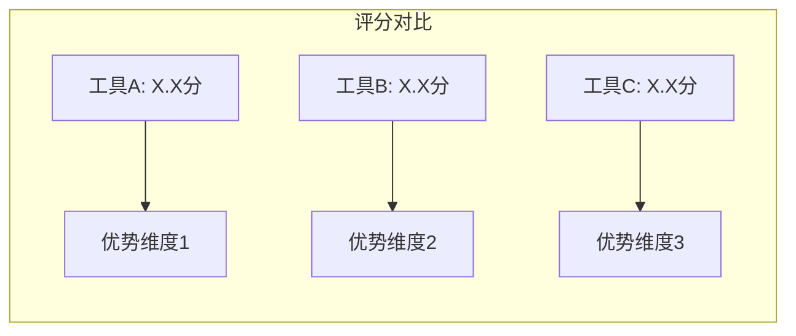
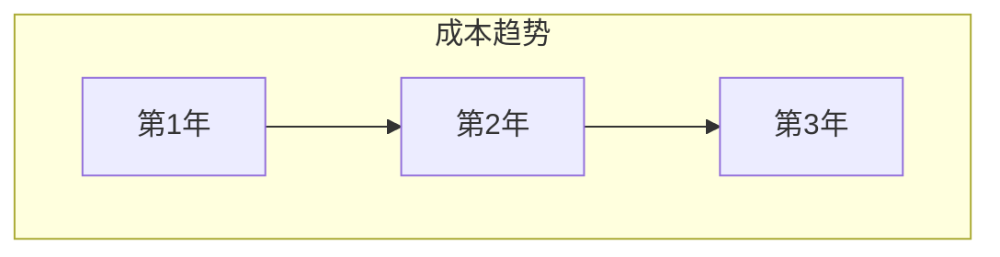

<!-- PREAMBLE_SECTION_START -->
## Preamble (run first)

```bash
_UPD=$(~/.claude/skills/cto-fleet/bin/cto-fleet-update-check 2>/dev/null || true)
[ -n "$_UPD" ] && echo "$_UPD" || true
```

If output shows `UPGRADE_AVAILABLE <old> <new>`: read `~/.claude/skills/cto-fleet/cto-fleet-upgrade/SKILL.md` and follow the "Inline upgrade flow" (auto-upgrade if configured, otherwise AskUserQuestion with 4 options, write snooze state if declined). If `JUST_UPGRADED <from> <to>`: tell user "Running cto-fleet v{to} (just updated!)" and continue.
<!-- PREAMBLE_SECTION_END -->

**参数解析**：从 `$ARGUMENTS` 中检测以下标志：
- `--auto`：完全自主模式（不询问用户任何问题，全程自动决策）
- `--once`：单轮确认模式（将所有需要确认的问题合并为一轮提问，确认后全程自动执行）
- `--candidates=tool1,tool2,tool3`：候选工具/供应商列表（逗号分隔）
- `--usecase=描述`：使用场景描述（用于权重调整和集成评估）

| 模式 | 用户确认范围 | 条件节点处理 |
|------|-------------|-------------|
| **标准模式**（默认） | 候选确认 + 中间检查点 + 分歧仲裁 + 最终文档确认 | 正常询问用户 |
| **单轮确认模式**（`--once`） | 仅最终文档确认 | 自动决策 + 收尾汇总 |
| **完全自主模式**（`--auto`） | 不询问用户 | 全部自动决策，收尾汇总所有决策 |

单轮确认模式下条件节点自动决策规则：
- **候选范围不确定** → team lead 自行界定范围，在最终文档中说明
- **两位 researcher 分歧** → analyst 标注分歧，team lead 综合论证后裁决，收尾时汇总
- **分歧超过 50%** → **不可跳过，必须暂停问用户**（熔断机制）
- **两位 researcher 均报告"网络信息不足"** → **不可跳过，必须暂停问用户调整候选列表/关键词**（熔断机制）
- **评分矩阵中排名前两位差距 < 5%** → **不可跳过，必须暂停问用户做最终决策**（熔断机制，单轮确认模式和完全自主模式均适用）

完全自主模式下：所有节点均自动决策，不询问用户。熔断机制仍然生效——触发熔断条件时是唯一会暂停询问用户的情况。

使用 TeamCreate 创建 team（名称格式 `team-vendor-{YYYYMMDD-HHmmss}`，如 `team-vendor-20260308-143022`，避免多次调用冲突），你作为 team lead 按以下流程协调。

<!-- HANDOFF_SECTION_START -->
## 文件交接规范（File-Based Handoff）

所有 agent 间传递详细报告时，必须采用**文件交接模式**（防止上下文溢出触发 20MB 限制）：

1. **写入文件**：将完整报告写入团队工作目录：
   - 目录路径：`/tmp/{team-name}/`（team lead 在 TeamCreate 后执行 `mkdir -p /tmp/{team-name} && chmod 700 /tmp/{team-name}`）
   - 单个文件 ≤ 2000 行；超大报告拆分为 summary + details 文件
2. **发送引用**：通过 SendMessage 仅发送（≤500 字符）：
   - 文件路径（1 行）
   - 关键摘要（含核心指标/发现/评分）
3. **按需读取**：接收方使用 Read 按需读取文件，发送方不内联完整内容
4. **路径转发**：team lead 转发报告时只转发文件路径 + 摘要，不 Read 后再 SendMessage
5. **遵从校验**：team lead 收到超 1000 字符且不含 `/tmp/team-` 路径前缀的消息时，要求 agent 以文件交接模式重发

**文件命名规范**：

| 角色输出 | 文件名 |
|---------|--------|
| Scanner 报告 | `scanner-report.md` |
| Reviewer-N 第R轮 | `reviewer-{N}-round-{R}.md` |
| 合并报告第R轮 | `merged-report-round-{R}.md` |
| 根因分组 | `root-cause-groups-round-{R}.md` |
| Fixer 第R轮 | `fixer-round-{R}.md` |
| Tester 第R轮 | `tester-round-{R}.md` |
| Architect-N 方案 | `architect-{N}-design.md` |
| 任务拆解 | `task-breakdown.md` |
| Coder-N 任务T | `coder-{N}-task-{T}.md` |
| 审查任务T | `review-task-{T}.md` |
| 集成测试第R轮 | `integration-test-round-{R}.md` |
| 最终报告 | `final-report.md` |

> 仅当角色存在于当前 skill 时使用对应命名。未列出的角色用 `{role}-{context}.md` 格式。
<!-- HANDOFF_SECTION_END -->


## 流程概览

```
阶段零  定义评估标准 → team lead 解析候选列表和使用场景 → 构建加权评分矩阵
         ↓
阶段一  并行调研 → researcher-1 + researcher-2 独立评估每个候选工具/供应商
         ↓
阶段二  集成评估 → analyst 扫描代码库，评估各候选的集成难度和兼容性
         ↓
阶段三  合并对比 → analyst 对比两份调研报告 → 输出：共识/分歧/盲区 + 初步评分
         ↓
阶段四  文档生成 → writer 生成对比文档 + 评分矩阵 + 锁定风险分析 + POC 计划
         ↓
阶段五  决策文档（可选） → 用户确认后可通过 /team-adr 生成架构决策记录
         ↓
阶段六  收尾 → 保存文档 + 清理团队
```

## 角色定义

| 角色 | 职责 |
|------|------|
| researcher-1 | 独立调研每个候选工具/供应商：API 质量、文档完整度、社区健康度、安全记录、定价、发布节奏。**广度优先策略**：多组关键词、多角度搜索，覆盖面广。每条信息标注来源和信源等级。**独立工作，不与 researcher-2 交流。** |
| researcher-2 | 同 researcher-1 的职责，独立执行调研。**深度优先策略**：少量精准关键词、对重点来源深入阅读分析。每条信息标注来源和信源等级。**独立工作，不与 researcher-1 交流。** |
| analyst | 扫描代码库评估集成难度；对比两位 researcher 的报告，输出结构化分析：共识清单、互补清单、分歧清单、盲区清单；生成初步评分矩阵。**只做分析，不写最终文档，不自行搜索。** 根本性矛盾必须标注为"待仲裁"升级 team lead。 |
| writer | 基于 analyst 的分析结果、仲裁结论和评分矩阵，生成最终对比文档、锁定风险分析和 POC 计划。**不做分析判断，不自行搜索。** |

## 评估维度与权重

| 维度 | 默认权重 | 说明 |
|------|---------|------|
| API 质量与开发者体验 | 20% | API 设计一致性、SDK 质量、错误处理、调试工具 |
| 文档完整度 | 10% | 官方文档覆盖率、示例代码、迁移指南、变更日志 |
| 社区健康度 | 15% | GitHub stars、贡献者数量、issue 响应时间、Stack Overflow 活跃度 |
| 安全记录 | 15% | CVE 历史、漏洞响应时间、安全审计报告、合规认证 |
| 定价与成本预测 | 15% | 定价模型、阶梯价格、隐性成本、长期成本趋势 |
| 代码库集成难度 | 15% | 与现有代码的兼容性、依赖冲突、抽象层适配 |
| 锁定风险 | 10% | 切换成本、数据可移植性、标准协议支持、供应商依赖度 |

**权重调整规则**：team lead 根据 `--usecase` 参数可微调权重（总和保持 100%），在阶段零向用户确认。

## 信源可信度分级

Researcher 在报告中为每条信息标注信源等级，analyst 在分析时考虑权重：

| 等级 | 来源类型 | 权重 |
|------|---------|------|
| **S** | 官方文档、API 参考、官方定价页面、安全审计报告 | 最高 |
| **A** | 独立基准测试、同行评审的对比报告、权威技术媒体 | 高 |
| **B** | 知名技术博客、会议演讲、成熟开源项目文档 | 中 |
| **C** | 社区讨论、个人博客、问答网站 | 低 |
| **D** | 未标注来源、AI 生成内容、过时信息（>2年） | 不采纳 |

信源等级冲突时，高等级来源优先。两个同等级来源矛盾时，标注为分歧待仲裁。

---

## 阶段零：定义评估标准

### 步骤 1：解析候选列表和使用场景

Team lead 解析 `$ARGUMENTS` 中的参数：
- 提取 `--candidates` 中的候选工具/供应商列表
- 提取 `--usecase` 中的使用场景描述
- 如果未提供 `--candidates`，从主题描述中推断候选列表
- 扫描当前工作目录了解项目技术栈（语言、框架、依赖管理）

### 步骤 2：构建加权评分矩阵

基于使用场景调整评估维度权重：
- 如果是安全敏感场景 → 提高"安全记录"权重
- 如果是成本敏感场景 → 提高"定价与成本预测"权重
- 如果是遗留系统集成 → 提高"代码库集成难度"权重
- 总权重保持 100%

### 步骤 3：确认评估范围

- 如果候选列表明确 → 直接进入阶段一
- 如果候选列表不完整或使用场景模糊：
  - **标准模式**：向用户展示候选列表、评估维度和权重，AskUserQuestion 确认范围和重点
  - **单轮确认模式**：team lead 自行界定范围，收尾时说明
  - **完全自主模式**：自动决策，不询问用户

---

## 阶段一：并行调研

### 步骤 4：启动 researcher-1 和 researcher-2

两者并行启动，全程保持存活直到收尾。Team lead 将候选列表和评估维度发给两位 researcher，两者独立调研所有候选工具/供应商。

**Researcher-1（广度优先）**：
- 每个候选工具按 7 个评估维度逐一调研：
  - **API 质量**：搜索官方 API 文档、SDK 仓库、开发者论坛反馈（WebSearch/WebFetch）
  - **文档完整度**：检查官方文档站点结构、示例代码覆盖率、变更日志完整性
  - **社区健康度**：GitHub 仓库数据（stars/forks/contributors/issue 响应时间）、Stack Overflow 标签活跃度
  - **安全记录**：搜索 CVE 数据库、安全公告页面、合规认证
  - **定价**：官方定价页面、阶梯价格、免费额度、企业定价
  - **发布节奏**：GitHub releases 页面、变更日志频率、LTS 策略
  - **锁定风险**：数据导出能力、标准协议支持、迁移工具/指南
- 每条信息标注来源 URL/路径 + 信源等级（S/A/B/C/D）
- 输出：按候选工具 × 评估维度组织的发现矩阵 + 来源索引

**Researcher-2（深度优先）**：
- 每个候选工具选取 2-3 个关键维度深入调研：
  - 对官方文档和核心 API 做深度阅读（WebFetch 全文提取）
  - 搜索真实用户迁移经验和踩坑记录
  - 分析定价模型的隐性成本（带宽费、存储费、API 调用超额费等）
  - 深入分析安全漏洞的严重性和修复时间线
- 每条信息标注来源 URL/路径 + 信源等级（S/A/B/C/D）
- 输出：按候选工具 × 评估维度组织的深度分析报告 + 来源索引

**搜索终止条件**：每位 researcher 单次搜索如果返回无关结果，调整关键词重试，单个方向最多重试 3 轮。3 轮后仍无结果则标注"该方向网络信息不足"并继续其他维度。

### 步骤 5：收集报告

两者完成后各自向 team lead 发送报告。Team lead 确认收到全部 2 份报告后，进入阶段二。

---

## 阶段二：集成评估

### 步骤 6：启动 analyst 扫描代码库

Team lead 启动 analyst，将以下内容传递：
- 候选工具列表
- 当前项目技术栈信息
- 使用场景描述

### 步骤 7：Analyst 代码库集成分析

Analyst 扫描代码库，评估每个候选工具的集成难度：

1. **依赖分析**：扫描 `package.json`/`go.mod`/`Cargo.toml`/`requirements.txt` 等，检查是否存在冲突依赖
2. **导入模式分析**：搜索现有代码中与候选工具同类的 import/require 模式（Grep/Glob）
3. **抽象层评估**：检查是否存在可复用的接口/抽象层（如 adapter pattern、provider pattern）
4. **替换范围估算**：如果是替换现有工具，估算需要修改的文件数和代码行数
5. **兼容性检查**：运行时版本要求、操作系统兼容性、构建工具兼容性

Analyst 输出：
- 每个候选工具的集成难度评级（低/中/高）
- 预估集成工作量（人天）
- 潜在风险点列表
- 建议的集成路径

---

## 阶段三：合并对比

### 步骤 8：Analyst 对比分析

Team lead 将以下内容传递给 analyst：
- Researcher-1 的调研报告（标记为"研究员 A"）
- Researcher-2 的调研报告（标记为"研究员 B"）
- 代码库集成分析结果

**重要**：传递时不透露 researcher 编号，仅用"研究员 A"和"研究员 B"标记，避免暗示优先级。

### 步骤 9：Analyst 结构化对比

Analyst 按候选工具 × 评估维度逐项对比两份报告，输出结构化分析结果：

| 对比结果 | 处理方式 |
|---------|---------|
| **一致结论** | 直接采纳，标记为"共识" |
| **互补发现**（A 发现了 B 没注意的点，或反之） | 合并，标记为"互补" |
| **措辞/粒度差异**（本质相同，表述不同） | 合并最佳表述，标记为"共识" |
| **分歧/矛盾**（对同一工具有不同评价） | 标注为"待仲裁"，记录双方观点和来源 |

Analyst 输出：
1. **共识清单**：双方一致的核心评价
2. **互补清单**：一方独有的有价值发现
3. **分歧清单**：矛盾之处及双方来源对比
4. **盲区清单**：两人都未充分覆盖的维度或候选工具
5. **初步评分矩阵**：基于共识和互补发现的各维度初步评分（1-10 分）

附带：
- **共识度评估**：共识度 = (共识发现数 + 互补发现数) / 总发现数(去重并集) x 100%
- **信源质量初评**：标注主要依赖的信源等级分布

### 步骤 10：检查熔断条件

如果共识度 < 50%（分歧占比超过一半）：
- **必须暂停**，team lead 向用户报告情况
- 可能原因：候选工具信息来源矛盾、评估标准理解偏差
- 建议：明确评估标准或缩减候选范围

共识度 >= 50%：继续。

### 步骤 11：中间检查点

- **标准模式**：team lead 向用户展示初步评分矩阵（各候选工具 × 各维度评分），AskUserQuestion 确认评估方向是否正确、是否需要调整权重
- **单轮确认模式**：跳过，直接进入步骤 12
- **完全自主模式**：自动决策，不询问用户

### 步骤 12：分歧仲裁

如果分歧清单为空 → 跳过仲裁。

Team lead 对分歧清单中的每个分歧点：
1. 将分歧描述分别发给 researcher-1 和 researcher-2，要求各自提供论证：
   - 你的评价是什么？
   - 依据哪些来源（附 URL/路径和信源等级）？
   - 为什么你认为对方的评价不准确？
2. 收到双方论证后：
   - **标准模式**：team lead 向用户展示分歧摘要和双方论证，AskUserQuestion 让用户裁决
   - **单轮确认模式**：team lead 综合双方论证和信源等级自行裁决
   - **完全自主模式**：自动决策，不询问用户
3. 将仲裁结果发送给 analyst 更新评分矩阵

---

## 阶段四：文档生成

### 步骤 13：启动 writer 生成最终文档

Team lead 启动 writer，将以下内容传递：
- Analyst 的结构化对比分析报告
- 最终评分矩阵（含仲裁后更新）
- 代码库集成分析结果
- 候选列表和使用场景
- 评估维度和权重

Writer 生成最终供应商对比文档。文档格式：

```markdown
# [评估主题] 供应商/工具对比报告

> 生成时间：YYYY-MM-DD | 使用场景：[场景描述] | 共识度：XX%

## 1. 摘要
[200-300 字的评估背景、核心结论和推荐方案]

## 2. 评估背景
### 使用场景
[详细的使用场景描述和技术约束]

### 候选列表
| 候选工具 | 类型 | 版本 | 官网 |
|---------|------|------|------|
| [工具名] | [类型] | [版本] | [链接] |

## 3. 评分矩阵

### 总分排名
| 排名 | 候选工具 | 加权总分 | 推荐等级 |
|------|---------|---------|---------|
| 1 | [工具名] | XX.X/10 | 强烈推荐/推荐/可选/不推荐 |

### 详细评分
| 评估维度 | 权重 | [工具A] | [工具B] | [工具C] |
|---------|------|---------|---------|---------|
| API 质量与开发者体验 | 20% | X.X | X.X | X.X |
| 文档完整度 | 10% | X.X | X.X | X.X |
| 社区健康度 | 15% | X.X | X.X | X.X |
| 安全记录 | 15% | X.X | X.X | X.X |
| 定价与成本预测 | 15% | X.X | X.X | X.X |
| 代码库集成难度 | 15% | X.X | X.X | X.X |
| 锁定风险 | 10% | X.X | X.X | X.X |
| **加权总分** | **100%** | **X.X** | **X.X** | **X.X** |



## 4. 各候选详细分析

### 4.1 [工具A]
#### 优势
- [优势1]
- [优势2]

#### 劣势
- [劣势1]
- [劣势2]

#### 各维度详评
[按7个维度逐一详细分析]

### 4.2 [工具B]
[同上结构]

## 5. 锁定风险分析

| 候选工具 | 切换成本 | 数据可移植性 | 标准协议支持 | 供应商依赖度 | 风险等级 |
|---------|---------|-------------|-------------|-------------|---------|
| [工具名] | 高/中/低 | [描述] | [描述] | [描述] | 高/中/低 |

### 锁定风险详述
[每个候选工具的锁定风险详细分析，包含迁移路径建议]

## 6. 代码库集成评估

| 候选工具 | 集成难度 | 预估工作量 | 依赖冲突 | 修改范围 |
|---------|---------|-----------|---------|---------|
| [工具名] | 高/中/低 | X 人天 | 有/无 | X 文件 |

### 集成路径建议
[每个候选工具的推荐集成路径]

## 7. 成本对比

| 候选工具 | 免费额度 | 月费（预估用量） | 年费 | 隐性成本 |
|---------|---------|----------------|------|---------|
| [工具名] | [描述] | [金额] | [金额] | [描述] |



## 8. POC 计划

### 验收标准（Go/No-Go 判定条件）
| 判定项 | Go 条件 | No-Go 条件 |
|--------|---------|-----------|
| [判定项1] | [条件] | [条件] |

### POC 执行计划
| 阶段 | 工作内容 | 耗时 | 产出物 |
|------|---------|------|--------|
| 准备 | [内容] | X天 | [产出] |
| 实施 | [内容] | X天 | [产出] |
| 验证 | [内容] | X天 | [产出] |

## 9. 结论与建议

| 结论 | 置信度 | 关键支撑来源 |
|------|--------|-------------|
| [结论 1] | 高/中/低 | [来源] |
| [结论 2] | 高/中/低 | [来源] |

### 推荐方案
[最终推荐及理由]

### 行动建议
1. [建议 1]
2. [建议 2]

## 10. 参考来源
| 序号 | 来源 | 类型 | 信源等级 | URL/路径 |
|------|------|------|---------|---------|
| 1 | [来源名] | 网络/本地 | S/A/B/C | [链接] |

## 附录 A：调研共识说明

### 共识结论
[两位研究员一致的核心评价列表]

### 分歧点及仲裁结果
| 分歧点 | 研究员 A 观点 | 研究员 B 观点 | 仲裁结果 | 理由 |
|--------|-------------|-------------|---------|------|
| [描述] | [观点] | [观点] | [结论] | [理由] |

## 附录 B：评分方法说明

### 评分标准
| 分数区间 | 含义 |
|---------|------|
| 9-10 | 卓越，行业领先 |
| 7-8 | 优秀，满足所有需求 |
| 5-6 | 合格，基本满足需求 |
| 3-4 | 不足，存在明显短板 |
| 1-2 | 差，无法满足基本需求 |

### 权重调整说明
[如果权重与默认值不同，说明调整理由]
```

**注意**：每张 Mermaid 图不超过 15 个节点。如果内容复杂，分多张图展示。

### 步骤 14：用户确认

Team lead 向用户展示文档摘要：
- 评估主题和候选列表
- 评分矩阵总分排名（前 3 名）
- 推荐方案及核心理由
- 锁定风险最高的候选
- 共识度
- 参考来源数量和信源等级分布

AskUserQuestion 确认：
- 接受文档
- 需要补充某些维度的调研
- 需要调整权重重新评分
- 是否需要生成 ADR（架构决策记录）

**单轮确认模式**：必须经用户确认。

**完全自主模式**：自动决策，不询问用户，收尾时汇总。

---

## 阶段五：决策文档（可选）

### 步骤 15：ADR 生成

如果用户确认需要生成 ADR：
- 向用户说明将调用 `/team-adr` 技能
- 将评估结论、推荐方案和理由作为输入传递给 `/team-adr`

如果用户不需要 ADR → 跳过此阶段。

---

## 阶段六：收尾

### 步骤 16：保存文档

将最终供应商对比文档保存到项目的 `docs/vendor-evaluation/` 目录：
- 文件名：`vendor-eval-YYYY-MM-DD-<topic>.md`
- 如果目录不存在，创建之

### 步骤 17：最终总结

Team lead 向用户输出：
- 评估了什么（候选列表、使用场景、评估维度）
- 评分矩阵总分排名
- 推荐方案及核心理由
- 锁定风险提示
- 集成评估概要
- 共识度和分歧处理情况
- 文档保存位置
- **（单轮确认模式/完全自主模式）自动决策汇总**：列出所有自动决策的节点、决策内容和理由

### 步骤 18：清理

关闭所有 teammate，用 TeamDelete 清理 team。

---

## 核心原则

- **维度驱动**：基于加权评分矩阵系统化评估，避免主观偏好
- **独立调研**：两位 researcher 必须完全独立工作，不互相看到对方结果，确保共识的客观性
- **代码库结合**：analyst 必须扫描实际代码库，评估真实集成难度，而非仅凭文档推测
- **信源分级**：所有信息标注来源和可信度等级，高等级来源优先
- **职责分离**：analyst 只分析不写文档，writer 只写作不判断
- **锁定风险优先**：每个候选工具必须独立分析锁定风险和退出策略
- **可操作输出**：文档必须包含 POC 计划和 Go/No-Go 判定条件，便于落地执行

---

### 共识度计算

team lead 按五维度评估双路分析的共识度：

| 维度 | 权重 |
|------|------|
| 调研结论一致性（相同问题/结论） | 20% |
| 互补性（独有但不矛盾的调研结论） | 20% |
| 分歧程度（直接矛盾的结论） | 20% |
| 严重度一致性（同一问题的严重等级差异） | 20% |
| 覆盖完整性（两路合并后的覆盖面） | 20% |

共识度 = 各维度加权得分之和

- **≥ 60%**：自动合并，分歧项由 team lead 裁决
- **50-59%**：合并但标注分歧，收尾时汇总争议点
- **< 50%**：触发熔断，暂停并向用户确认方向

---

## 错误处理

| 异常情况 | 处理方式 |
|---------|---------|
| 候选列表未指定 | Team lead 根据使用场景搜索主流候选，标准模式请用户确认 |
| 使用场景不明确 | Team lead 扫描代码库推断技术需求，标准模式请用户确认 |
| 网络搜索无有效结果 | Researcher 调整关键词重试，最多 3 轮；仍无结果标注"网络信息不足" |
| 候选工具官网无法访问 | Researcher 标注"官网无法访问"，尝试从第三方来源获取信息 |
| 两位 researcher 调研差异极大（共识度 < 50%） | 触发熔断，暂停问用户确认评估方向 |
| 评分矩阵前两名差距 < 5% | 触发熔断，暂停问用户做最终决策 |
| 代码库扫描无法识别技术栈 | Analyst 标注"技术栈未识别"，集成评估基于通用场景 |
| WebFetch 目标页面无法访问 | Researcher 跳过该来源，标注为"无法访问" |
| 候选工具为闭源/信息有限 | Researcher 标注"信息有限"，降低该维度评分置信度 |
| 定价信息需要联系销售 | Researcher 标注"定价不透明"，基于公开信息估算 |
| Teammate 无响应/崩溃 | Team lead 重新启动同名 teammate（传入完整上下文），从当前阶段恢复 |

---

## 需求

$ARGUMENTS

<!-- ERROR_HANDLING_SECTION_START -->
### 错误处理

| 场景 | 处理方式 |
|------|---------|
| Teammate 无响应/崩溃 | Team lead 重新启动同名 teammate（传入完整上下文），从最近的检查点恢复 |
| 某阶段产出质量不达标 | 记录问题，在收尾阶段汇总，不阻塞后续流程（除非是熔断条件） |
| 用户中途修改需求 | 暂停当前阶段，重新评估影响范围，必要时回退到受影响的最早阶段 |

### 熔断机制（不可跳过）

以下条件触发时，**无论 `--auto` 还是 `--once` 模式，都必须暂停并向用户确认**：

- 共识度 < 50%（双路分析严重分歧）
- 迭代超过最大轮数仍未达标
- 关键依赖缺失（无法继续执行的前置条件不满足）

触发熔断时，向用户展示：当前状态、分歧/问题摘要、建议的下一步选项。
<!-- ERROR_HANDLING_SECTION_END -->

